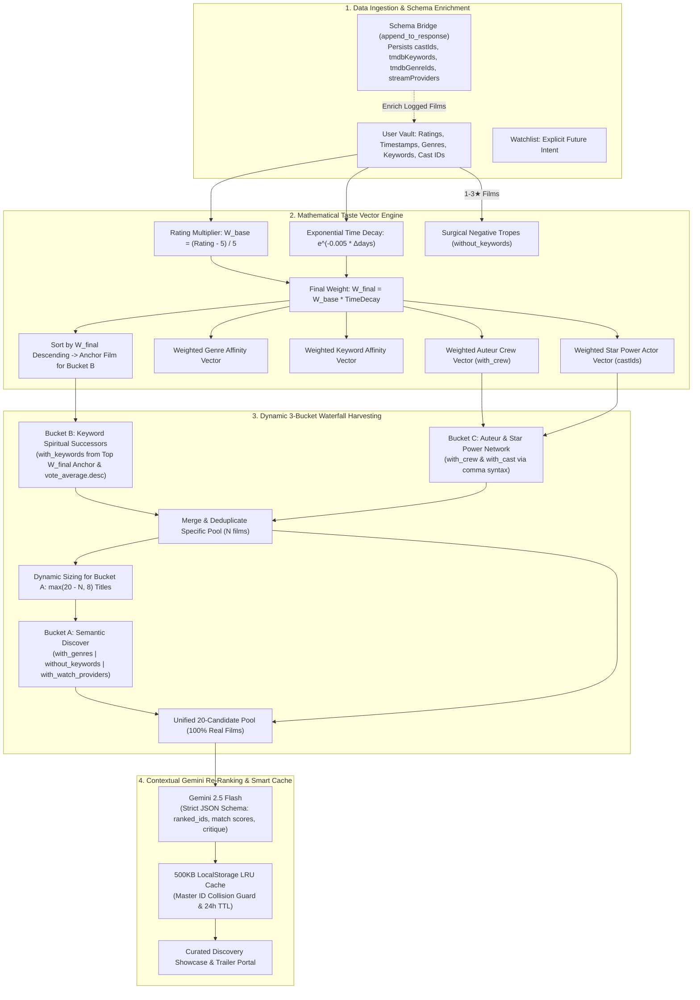

# 🏛️ CinemaVault — Comprehensive Architecture & Mathematics Specification (v3.0)

**CinemaVault** is an open-source, client-side cinema logging, analytics, and recommendation platform. This document serves as the **definitive technical specification** for CinemaVault v3.0, covering the complete mathematical formulations, candidate harvesting algorithms, TMDB API grammar rules, structured LLM re-ranking pipelines, client-side caching strategies, and data persistence models.

---

## Table of Contents

1. [Executive Summary & Core Philosophy](#1-executive-summary--core-philosophy)
2. [Why Pure LLM Recommenders Fail (The 5 Fatal Flaws)](#2-why-pure-llm-recommenders-fail-the-5-fatal-flaws)
3. [Mathematical Taste Vector Formulation](#3-mathematical-taste-vector-formulation)
   - [3.1 Continuous Rating Weights ($W_{\text{base}}$)](#31-continuous-rating-weights-w_textbase)
   - [3.2 Exponential Recency Time-Decay ($W_{\text{final}}$)](#32-exponential-recency-time-decay-w_textfinal)
   - [3.3 Temporally-Weighted Anchor Film Selection](#33-temporally-weighted-anchor-film-selection)
   - [3.4 Granular Negative Trope Extraction (`without_keywords`)](#34-granular-negative-trope-extraction-without_keywords)
   - [3.5 Star-Power & Auteur Graphing](#35-star-power--auteur-graphing)
4. [The Deterministic 3-Bucket Waterfall Pipeline](#4-the-deterministic-3-bucket-waterfall-pipeline)
   - [4.1 Bucket B: Keyword Spiritual Successors](#41-bucket-b-keyword-spiritual-successors)
   - [4.2 Bucket C: Auteur & Star Power Network](#42-bucket-c-auteur--star-power-network)
   - [4.3 Bucket A: Semantic Discover Engine](#43-bucket-a-semantic-discover-engine)
   - [4.4 Dynamic Waterfall Sizing & Guarantees](#44-dynamic-waterfall-sizing--guarantees)
   - [4.5 Cold-Start Bypass Engine](#45-cold-start-bypass-engine)
5. [TMDB API Query Grammar & Syntax Rules](#5-tmdb-api-query-grammar--syntax-rules)
6. [Schema Bridge & Metadata Persistence (`bridgeTmdbToOmdb`)](#6-schema-bridge--metadata-persistence-bridgetmdbtoomdb)
7. [Structured Gemini Re-Ranking & Failover Chain](#7-structured-gemini-re-ranking--failover-chain)
8. [Smart LRU Cache & Master ID Collision Guard](#8-smart-lru-cache--master-id-collision-guard)
9. [Universal Streaming Access & Multi-Region Matrix](#9-universal-streaming-access--multi-region-matrix)
10. [Zero-CLS Luxury Trailer Portal](#10-zero-cls-luxury-trailer-portal)
11. [Telemetry Analytics & Statistical Algorithms](#11-telemetry-analytics--statistical-algorithms)
12. [Two-Way Letterboxd Portability & Batch Importer](#12-two-way-letterboxd-portability--batch-importer)
13. [Complete Reference Implementations (Code Blocks)](#13-complete-reference-implementations-code-blocks)

---

## 1. Executive Summary & Core Philosophy

Most AI movie tools operate as **unconstrained text generators**: they prompt an LLM with a list of favorite movies and ask it to invent 10 recommendations. This leads to catalog hallucinations (invented release years, false cast members, nonexistent films), stale echo chambers (recommending the same 10 mainstream titles like *Inception* or *Interstellar*), and broken UI states.

CinemaVault v3.0 fundamentally separates **catalog harvesting** from **contextual re-ranking**:



---

## 2. Why Pure LLM Recommenders Fail (The 5 Fatal Flaws)

1. **The Hallucination Trap**: Pure LLMs hallucinate release years, sequels that never existed, and mismatched directors. CinemaVault guarantees **0% hallucination** because Gemini is strictly forbidden from inventing titles — it only ranks candidates harvested from TMDB.
2. **The Echo Chamber Trap**: Simple prompts repeat ubiquitous blockbusters (*The Dark Knight*, *Pulp Fiction*). CinemaVault breaks the echo chamber by harvesting across three distinct programmatic buckets (spiritual keyword successors, auteur networks, and semantic discover).
3. **The TMDB `/recommendations` Endpoint Trap**: TMDB's native `/movie/{id}/recommendations` endpoint is a simplistic heuristic based on generic user list overlap. CinemaVault instead uses deep keyword graph discovery (`with_keywords`) sorted by critical acclaim (`vote_average.desc`), producing genuine spiritual successors.
4. **The Broad Genre Blacklist Trap**: Banning an entire genre like "Action" because a user hated a superhero movie blocks masterpieces like *Seven Samurai* or *Heat*. CinemaVault instead extracts micro-keywords (*"superhero"*, *"slapstick"*, *"parody"*) from $1-3\star$ films and applies surgical `without_keywords` filters.
5. **The Temporal Blindspot**: A favorite movie rated 10/10 four years ago shouldn't outweigh a film the user is obsessed with right now. CinemaVault applies half-life exponential time-decay to capture current obsessions.

---

## 3. Mathematical Taste Vector Formulation

### 3.1 Continuous Rating Weights ($W_{\text{base}}$)
CinemaVault maps user ratings (1 to 10 stars) onto a continuous mathematical multiplier:

$$W_{\text{base}} = \max\left(0, \frac{\text{Rating} - 5}{5}\right)$$

| Star Rating | $W_{\text{base}}$ Value | Influence Tier | Algorithmic Role |
| :---: | :---: | :--- | :--- |
| **10 / 10** | **1.00** | Masterpiece Anchor | Primary anchor candidate for Bucket B & Auteur networks |
| **9 / 10** | **0.80** | Core Affinity Anchor | Secondary anchor candidate; strong positive genre boost |
| **8 / 10** | **0.60** | Strong Positive Affinity | Cast and director vector accumulation |
| **7 / 10** | **0.40** | Baseline Affinity | Moderate positive genre weighting |
| **6 / 10** | **0.20** | Mild Positive | Neutral baseline |
| **$\le$ 5 / 10** | **0.00** | Disliked / Trope Source | Positive weights zeroed; used to extract hated tropes |

### 3.2 Exponential Recency Time-Decay ($W_{\text{final}}$)
To ensure recommendations dynamically reflect evolving tastes, every rated film's base weight is modulated by an exponential decay function:

$$W_{\text{final}} = W_{\text{base}} \times e^{-\lambda \cdot \Delta t}$$

Where:
- $\Delta t = \frac{\text{Date.now}() - t_{\text{watched}}}{1000 \times 60 \times 60 \times 24}$ (elapsed time in days).
- $\lambda = 0.005$ ($\text{Half-life} = \frac{\ln(2)}{0.005} \approx 138.6\text{ days}$).

#### Recency Decay Table ($\lambda = 0.005$):
- **Day 0 (Today)**: $e^{0} = 1.000$ (100% of base weight)
- **Day 30 (1 Month)**: $e^{-0.15} \approx 0.861$ (86.1% of base weight)
- **Day 90 (3 Months)**: $e^{-0.45} \approx 0.638$ (63.8% of base weight)
- **Day 140 (~Half-Life)**: $e^{-0.70} \approx 0.496$ (50% of base weight)
- **Day 365 (1 Year)**: $e^{-1.825} \approx 0.161$ (16.1% of base weight)

### 3.3 Temporally-Weighted Anchor Film Selection
Bucket B requires a high-affinity anchor film to extract thematic keywords. CinemaVault sorts all elite films ($\text{Rating} \ge 9$) by $W_{\text{final}}$ descending:

$$\text{AnchorMovie} = \arg\max_{m \in \text{Rated}, \text{Rating}(m) \ge 9} W_{\text{final}}(m)$$

If no film is rated $\ge 9$, the algorithm falls back to the highest $W_{\text{final}}$ film rated $\ge 8$.

### 3.4 Granular Negative Trope Extraction (`without_keywords`)
Instead of excluding broad genres, the profiler iterates over movies rated $\le 3\star$:

$$\text{HatedKeywords} = \left\{ k \in m.\text{tmdbKeywords} \mid m \in \text{Rated}, \text{Rating}(m) \le 3 \right\}$$

The top 5 most frequently occurring hated keyword IDs are passed to TMDB using pipe OR syntax (`without_keywords=9715|10402`), surgically removing specific tropes (*superhero*, *slapstick*, *musical*) without banning entire genres like Action or Drama.

### 3.5 Star-Power & Auteur Graphing
High-rated films ($\text{Rating} \ge 8$) contribute their creative personnel to weighted frequency vectors:
- **Star-Power Actors**: The top 3 billed cast IDs (`castIds[0..2]`) accumulate $W_{\text{final}}$. The top 2 recurring actors are injected into Bucket A discover queries.
- **Auteur Directors & Crew**: Directors, Cinematographers, and Screenwriters accumulate $W_{\text{final}}$. The highest-scoring single crew member ID (`topCrewMemberId`) is queried in Bucket C.

---

## 4. The Deterministic 3-Bucket Waterfall Pipeline

### 4.1 Bucket B: Keyword Spiritual Successors
- **Objective**: Discover high-acclaim films that share core micro-keywords with the user's top $W_{\text{final}}$ anchor film.
- **Methodology**: Fetches the top 3 keyword IDs from the anchor film and queries TMDB `/discover/movie` with `sort_by=vote_average.desc` and `vote_count.gte=200`.
- **Target Harvest**: 8 candidates.

### 4.2 Bucket C: Auteur & Star Power Network
- **Objective**: Harvest films from the user's favorite directors, cinematographers, and recurring lead actors.
- **Methodology**: Queries TMDB with `with_crew={topCrewMemberId}` and `sort_by=vote_average.desc`.
- **Target Harvest**: 4 candidates (executed concurrently with Bucket B via `Promise.all`).

### 4.3 Bucket A: Semantic Discover Engine
- **Objective**: Broad discovery based on weighted genre affinities, active mood vectors, and user streaming provider filters.
- **Methodology**: Queries TMDB with weighted `with_genres` (pipe-separated), `without_keywords` (hated tropes), and `with_cast` (comma-separated).
- **Target Harvest**: Dynamically sized to fill remaining candidate slots.

### 4.4 Dynamic Waterfall Sizing & Guarantees
If Buckets B & C return $N$ combined unique candidates:

$$\text{Target}_A = \max(20 - N, 8)$$

The orchestrator merges specific candidates first, appends Bucket A candidates, and triggers a top-up pass if necessary to guarantee an exact **20-candidate pool**.

### 4.5 Cold-Start Bypass Engine
For accounts with $< 3$ rated films, specific keyword and crew graphs lack statistical significance. CinemaVault automatically bypasses Buckets B & C and routes directly to an expanded Bucket A, harvesting 20 diverse, highly-rated films calibrated to the selected mood and watchlist genres.

---

## 5. TMDB API Query Grammar & Syntax Rules

The TMDB `/discover/movie` API enforces specific boolean logic conventions across parameter types:

| Parameter Type | Parameter Name | Delimiter | Boolean Logic | TMDB Example |
| :--- | :--- | :---: | :---: | :--- |
| **Genres** | `with_genres` | `\|` (Pipe) | **OR** | `with_genres=28\|878` (Action OR Sci-Fi) |
| **Keywords** | `with_keywords` | `\|` (Pipe) | **OR** | `with_keywords=9715\|10402` |
| **Excluded Keywords** | `without_keywords`| `\|` (Pipe) | **OR** | `without_keywords=9715\|10402` |
| **Cast / Actors** | `with_cast` | `,` (Comma) | **OR** | `with_cast=67890,11122` (Robert De Niro OR Al Pacino) |
| **Crew Members** | `with_crew` | N/A | Single ID | `with_crew=12345` (Christopher Nolan) |
| **Watch Providers** | `with_watch_providers` | `\|` (Pipe) | **OR** | `with_watch_providers=8\|9\|337` (Netflix OR Prime OR Disney+) |

> [!IMPORTANT]
> - **People (`with_cast`)** in TMDB use commas `,` for OR logic, whereas **Genres & Keywords** use pipes `|`. Using pipe on `with_cast` will silently fail.
> - **Watch Providers** take integer provider IDs (`8|9`), NOT monetization strings like `flatrate`.
> - When `with_watch_providers` is passed, TMDB requires a valid 2-letter ISO `watch_region` code.

---

## 6. Schema Bridge & Metadata Persistence (`bridgeTmdbToOmdb`)

CinemaVault enriches every saved movie record by calling TMDB with `append_to_response=external_ids,credits,videos,keywords,watch/providers`:

```javascript
export async function bridgeTmdbToOmdb(tmdbMovie, userRegion = "GLOBAL") {
  if (!tmdbMovie) return null;
  const tmdbId = tmdbMovie.tmdbId || tmdbMovie.id;

  if (tmdbId) {
    const key = getTmdbKey();
    const url = `https://api.themoviedb.org/3/movie/${tmdbId}?api_key=${key}&append_to_response=external_ids,credits,videos,keywords,watch/providers&language=en-US`;
    const res = await fetch(url, { cache: "no-store" });
    if (res.ok) {
      const data = await res.json();
      const director = data.credits?.crew?.find(c => c.job === "Director")?.name || "Unknown";
      const crewPersonId = data.credits?.crew?.find(c => ["Director", "Director of Photography", "Original Music Composer", "Screenplay"].includes(c.job))?.id || null;
      const cast = (data.credits?.cast || []).slice(0, 5).map(c => c.name).join(", ") || "N/A";
      const castIds = (data.credits?.cast || []).slice(0, 5).map(c => c.id);
      const tmdbKeywords = (data.keywords?.keywords || []).slice(0, 10).map(k => k.id);
      const tmdbGenreIds = (data.genres || []).map(g => g.id);
      const trailerObj = (data.videos?.results || []).find(v => v.site === "YouTube" && (v.type === "Trailer" || v.type === "Teaser"));
      const imdbId = data.external_ids?.imdb_id || `tmdb_${tmdbId}`;

      const providerRegion = (userRegion && userRegion !== "GLOBAL")
        ? (data["watch/providers"]?.results?.[userRegion] || data["watch/providers"]?.results?.US)
        : (data["watch/providers"]?.results?.US || Object.values(data["watch/providers"]?.results || {})[0]);

      const streamProviders = (providerRegion?.flatrate || []).map(p => ({
        id: p.provider_id,
        name: p.provider_name,
        logo: `https://image.tmdb.org/t/p/original${p.logo_path}`
      }));

      return {
        imdbID: imdbId,
        tmdbId: data.id,
        title: data.title || tmdbMovie.title,
        year: data.release_date ? data.release_date.slice(0, 4) : "N/A",
        poster: data.poster_path ? `https://image.tmdb.org/t/p/w500${data.poster_path}` : getFallbackPoster(tmdbMovie.title),
        backdrop: data.backdrop_path ? `https://image.tmdb.org/t/p/original${data.backdrop_path}` : null,
        runtime: data.runtime ? `${data.runtime} min` : "N/A",
        genre: (data.genres || []).map(g => g.name).join(", ") || "Cinema",
        tmdbGenreIds,
        imdbRating: data.vote_average ? String(data.vote_average.toFixed(1)) : "N/A",
        director,
        cast,
        castIds,
        crewPersonId,
        tmdbKeywords,
        trailerKey: trailerObj?.key || null,
        streamProviders,
        userRating: 0
      };
    }
  }
}
```

---

## 7. Structured Gemini Re-Ranking & Failover Chain

### Structured JSON Output Schema
Gemini receives the 20-candidate pool and returns a strictly typed JSON object:

```json
{
  "recommendations": [
    {
      "imdbID": "tt0110912",
      "tmdbId": 680,
      "title": "Pulp Fiction",
      "year": "1994",
      "matchScore": 96,
      "reason": "Directly matches your affinity for non-linear neo-noir crime sagas and sharp auteur dialogue."
    }
  ],
  "tasteProfile": {
    "favoriteGenres": ["Crime", "Thriller", "Drama"],
    "ratingStyle": "High appreciation for character-driven dialogue and visual pacing."
  }
}
```

### Regex Code-Fence Sanitizer (`sanitizeAndParseJSON`)
LLMs occasionally wrap JSON in markdown fences (` ```json ... ``` `). CinemaVault applies a resilient sanitizer:

```javascript
export function sanitizeAndParseJSON(rawText) {
  if (!rawText) throw new Error("Empty response from AI engine");
  let cleaned = String(rawText).trim();
  const jsonMatch = cleaned.match(/```(?:json)?\s*([\s\S]*?)\s*```/);
  if (jsonMatch) {
    cleaned = jsonMatch[1].trim();
  }
  return JSON.parse(cleaned);
}
```

### Failover Resilience Chain
1. **Primary**: `gemini-2.5-flash` with structured schema.
2. **Secondary Failover**: `gemini-2.0-flash` with identical schema.
3. **Deterministic Fallback Engine**: If all LLM calls fail, candidates are ranked deterministically by TMDB `vote_average`, ensuring 100% uptime.

---

## 8. Smart LRU Cache & Master ID Collision Guard

### Master ID Cross-Referencing Collision Guard
Smart Cache checks every cached recommendation against all known identifiers across both Watched and Watchlist datasets:

```javascript
export function getSmartCache(hash, watched = [], watchlist = []) {
  try {
    const cache = JSON.parse(localStorage.getItem(SMART_CACHE_KEY) || '{}');
    const entry = cache[hash];
    if (!entry || !entry.data || (Date.now() - (entry.ts || 0) > 24 * 60 * 60 * 1000)) {
      return null;
    }

    const currentIds = new Set([
      ...watched.flatMap(m => [
        m.imdbID ? String(m.imdbID).toLowerCase() : null,
        m.tmdbId ? String(m.tmdbId).toLowerCase() : null,
        m.id ? String(m.id).toLowerCase() : null
      ]).filter(Boolean),
      ...watchlist.flatMap(m => [
        m.imdbID ? String(m.imdbID).toLowerCase() : null,
        m.tmdbId ? String(m.tmdbId).toLowerCase() : null,
        m.id ? String(m.id).toLowerCase() : null
      ]).filter(Boolean)
    ]);

    const validRecs = (entry.data.recommendations || []).filter(rec => {
      const recIds = [
        rec.imdbID ? String(rec.imdbID).toLowerCase() : null,
        rec.tmdbId ? String(rec.tmdbId).toLowerCase() : null,
        rec.id ? String(rec.id).toLowerCase() : null
      ].filter(Boolean);

      return !recIds.some(id => currentIds.has(id));
    });

    if (validRecs.length >= 4) {
      return { ...entry.data, recommendations: validRecs };
    }
  } catch (e) {
    console.warn("SmartCache read failed:", e);
  }
  return null;
}
```

### 500KB LRU Eviction Policy
```javascript
export function setSmartCache(hash, data) {
  try {
    let cache = JSON.parse(localStorage.getItem(SMART_CACHE_KEY) || '{}');
    cache[hash] = { data, ts: Date.now() };

    let cacheStr = JSON.stringify(cache);
    while (cacheStr.length * 2 > 500 * 1024 && Object.keys(cache).length > 1) {
      const oldestKey = Object.keys(cache).reduce((oldest, key) =>
        (cache[key]?.ts || 0) < (cache[oldest]?.ts || 0) ? key : oldest
      );
      delete cache[oldestKey];
      cacheStr = JSON.stringify(cache);
    }

    localStorage.setItem(SMART_CACHE_KEY, cacheStr);
  } catch (e) {
    console.warn("SmartCache write failed:", e);
  }
}
```

---

## 9. Universal Streaming Access & Multi-Region Matrix

### Supported Streaming Providers
| Provider | TMDB ID | Icon |
| :--- | :---: | :---: |
| **Netflix** | `8` | 🔴 |
| **Amazon Prime Video** | `9` | 📦 |
| **Disney+** | `337` | ✨ |
| **Max (HBO)** | `1899` | 🟣 |
| **Apple TV+** | `350` | 🍏 |
| **Hulu** | `15` | 🟢 |
| **Paramount+** | `531` | 🏔️ |
| **Peacock** | `386` | 🦚 |
| **Criterion Channel** | `258` | 🏛️ |
| **Tubi (Free)** | `73` | 📺 |
| **Pluto TV (Free)** | `300` | ⚡ |
| **Freevee (Free)** | `573` | 🎬 |

### Supported Regions
`GLOBAL` (Worldwide), `US`, `GB`, `CA`, `AU`, `JP`, `KR`, `FR`, `DE`, `ES`, `IT`, `IN`, `BR`, `MX`, `SE`.

---

## 10. Zero-CLS Luxury Trailer Portal

`TrailerModal.jsx` mounts via React Portal (`document.body`) with `z-index: 10000`, background blur (`backdrop-filter: blur(24px)`), and a responsive 16:9 aspect ratio (`paddingTop: 56.25%`).

```jsx
<iframe
  src={`https://www.youtube-nocookie.com/embed/${trailerKey}?autoplay=1&rel=0&modestbranding=1`}
  title={`${title} Trailer`}
  allow="accelerometer; autoplay; clipboard-write; encrypted-media; gyroscope; picture-in-picture"
  allowFullScreen
  style={{ position: "absolute", top: 0, left: 0, width: "100%", height: "100%", border: "none" }}
/>
```

---

## 11. Telemetry Analytics & Statistical Algorithms

### 1. Rating Delta Histogram
Calculates the user's deviation from global IMDb baselines:

$$\Delta(m) = \text{UserRating}(m) - \text{ImdbRating}(m)$$

Bucketed into:
- Critical Contrariness ($\Delta \le -2.0$)
- Mild Skepticism ($-1.5 \le \Delta \le -0.5$)
- Consensus Neutral ($-0.5 < \Delta < +0.5$)
- Generous Affinity ($+0.5 \le \Delta \le +1.5$)
- Passionate Champion ($\Delta \ge +2.0$)

### 2. Watch Time Aggregator
$$\text{TotalMinutes} = \sum_{m \in \text{Watched}} \text{parseRuntimeMinutes}(m.\text{runtime})$$

Converted to Days, Hours, and Minutes display.

---

## 12. Two-Way Letterboxd Portability & Batch Importer

- **Export Format**: Standardized CSV format (`Title, Year, Rating10, WatchedDate`).
- **Import Engine**: Letterboxd CSVs are chunked into asynchronous batches (`BATCH_SIZE = 4`) to prevent browser throttling while querying OMDb/TMDB for verified poster URLs and canonical `imdbID` strings.
- **Modes**:
  - **Merge Mode**: Preserves existing custom reviews and ratings while appending new titles.
  - **Overwrite Mode**: Cleans vault and restores archive.

---

## 13. Complete Reference Implementations (Code Blocks)

### `extractTasteProfile` in `src/services/tmdbService.js`
```javascript
export async function extractTasteProfile(watched = [], watchlist = []) {
  const rated = (watched || []).filter(m => {
    const r = Number(m.userRating || m.UserRating || 0);
    return !isNaN(r) && r > 0;
  });

  const genreScores = {};
  const hatedKeywordCounts = {};
  const castScores = {};
  const crewScores = {};
  const DECAY_RATE = 0.005;

  const weightedRated = rated.map(movie => {
    const rating = Number(movie.userRating || movie.UserRating || 0);
    const addedTime = new Date(movie.dateWatched || movie.addedAt || Date.now()).getTime();
    const daysSince = Math.max(0, (Date.now() - addedTime) / (1000 * 60 * 60 * 24));
    const timeDecay = Math.exp(-DECAY_RATE * daysSince);

    const baseWeight = Math.max(0, (rating - 5) / 5);
    const finalWeight = baseWeight * timeDecay;

    const genreIds = movie.tmdbGenreIds || mapOmdbToTmdbGenreIds(movie.genre || movie.Genre || "");
    genreIds.forEach(id => {
      genreScores[id] = (genreScores[id] || 0) + finalWeight;
    });

    if (rating <= 3 && movie.tmdbKeywords && Array.isArray(movie.tmdbKeywords)) {
      movie.tmdbKeywords.forEach(kId => {
        hatedKeywordCounts[kId] = (hatedKeywordCounts[kId] || 0) + 1;
      });
    }

    if (rating >= 8) {
      if (movie.castIds && Array.isArray(movie.castIds)) {
        movie.castIds.slice(0, 3).forEach(cId => {
          castScores[cId] = (castScores[cId] || 0) + finalWeight;
        });
      }
      if (movie.crewPersonId) {
        crewScores[movie.crewPersonId] = (crewScores[movie.crewPersonId] || 0) + finalWeight;
      }
    }

    return { ...movie, finalWeight };
  });

  weightedRated.sort((a, b) => b.finalWeight - a.finalWeight);

  const lovedGenreIds = Object.entries(genreScores)
    .sort((a, b) => b[1] - a[1])
    .slice(0, 4)
    .map(([id]) => Number(id));

  const topCastIds = Object.entries(castScores)
    .sort((a, b) => b[1] - a[1])
    .slice(0, 2)
    .map(([id]) => Number(id));

  const topCrewMemberId = Object.entries(crewScores)
    .sort((a, b) => b[1] - a[1])
    .slice(0, 1)
    .map(([id]) => Number(id))[0] || null;

  const hatedKeywordIds = Object.entries(hatedKeywordCounts)
    .filter(([_, count]) => count >= 1)
    .slice(0, 5)
    .map(([id]) => Number(id));

  const eliteAnchors = weightedRated.filter(m => Number(m.userRating || 0) >= 9);
  let anchorTmdbId = null;
  if (eliteAnchors.length > 0) {
    anchorTmdbId = eliteAnchors[0].tmdbId || (await findTmdbByImdbId(eliteAnchors[0].imdbID))?.tmdbId || null;
  }

  return {
    lovedGenreIds,
    lovedGenreNames: lovedGenreIds.map(id => TMDB_ID_TO_GENRE[id] || `Genre ${id}`),
    topCastIds,
    topCrewMemberId,
    anchorTmdbId,
    hatedKeywordIds,
    totalRated: rated.length
  };
}
```

---

*Authored by **[Khuzaima](https://github.com/khuzaima175)** for the CinemaVault Project.*
