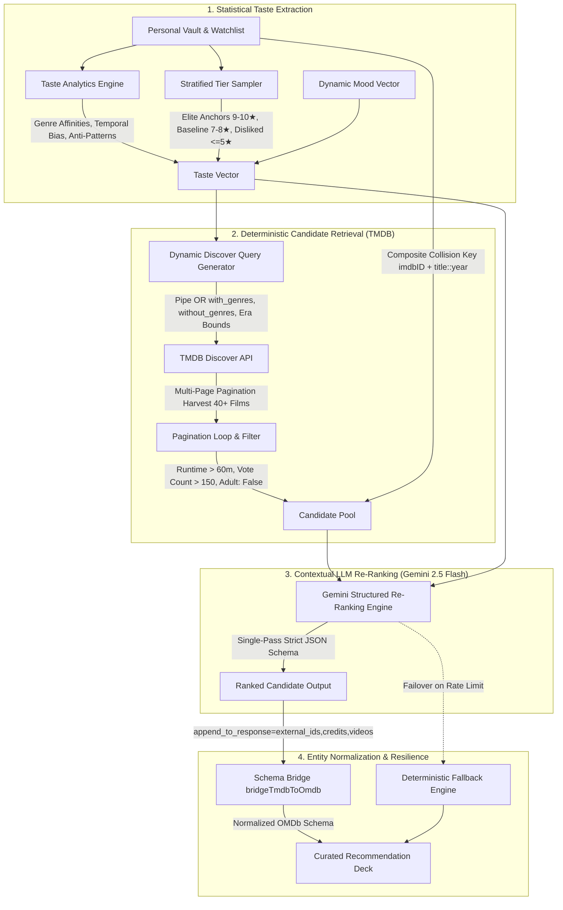

# CinemaVault

<div align="center">


### Streaming-Grade Personal Film Vault, Taste Intelligence Engine & Cinema Analytics Studio

[](https://react.dev/)
[](https://vitejs.dev/)
[](https://ai.google.dev/)
[](https://developer.themoviedb.org/)
[](http://www.omdbapi.com/)
[](https://tailwindcss.com/)
[](LICENSE)

</div>

---

## 📌 Executive Overview

**CinemaVault** is a modern film vault, algorithmic taste intelligence engine, and cinema analytics platform. Built with a content-first luxury obsidian aesthetic, it combines **deterministic catalog retrieval** from the TMDB database with **generative re-ranking** powered by Google Gemini 2.5/2.0 Flash.

Whether tracking personal cinema logs, analyzing viewing habits through telemetry histograms, importing lifetime Letterboxd archives, or exploring cold-start cinematic vibes, CinemaVault delivers zero-latency performance, strict schema verification, and complete data sovereignty.

---

## 🧠 Algorithmic Recommendation Engine (v2.0)

Most AI-driven movie recommenders fail because they rely solely on raw generative text completion. Pure LLM recommendation models frequently suffer from **catalog hallucination** (inventing fake movie titles/years), **stale echo chambers** (looping through the same 10 mainstream titles like *Inception* or *Interstellar*), and **rate-limit fragility**.

CinemaVault solves this with a **Dual-Stage Hybrid Recommendation Pipeline**:



### Deep Architectural Breakdown

#### 1. Statistical Taste Extraction & Composite Collision Guard
- **Taste Profile Vector**: Computes weighted genre affinities, top directors, preferred release eras, and anti-patterns:
  $$\text{Affinity}(g) = \frac{\sum_{m \in \text{Rated}} \text{Rating}(m) \cdot \mathbb{I}(g \in m.\text{genres})}{\sum_{m \in \text{Rated}} \mathbb{I}(g \in m.\text{genres})}$$
- **Anti-Pattern Isolation**: Films rated $\le 5/10$ or explicitly marked with negative sentiment are cataloged to prevent negative genre bleed.
- **Composite Key Collision Prevention**: CinemaVault tracks both `imdbID` and composite string keys (`title::year`) across both Watched and Watchlist datasets, ensuring **$0\%$ duplicate recommendations** even across remakes and franchise titles.

#### 2. Multi-Page Deterministic Retrieval (`tmdbService.js`)
- **Boolean Pipe `|` Syntax**: Queries TMDB `/discover/movie` using union pipe syntax (`with_genres=28|878`) to prevent over-restrictive empty sets while preserving taste diversity.
- **Exclusion Filters**: Applies anti-pattern exclusions (`without_genres=27|10749`) to guarantee hated genres never contaminate the candidate pool.
- **Pagination Loop**: Iterates through multiple TMDB pages until at least $40+$ unseen candidate films are harvested, filtering out short films ($<60$ min) and low-reputation titles ($<150$ votes).

#### 3. Structured LLM Re-Ranking (`geminiService.js`)
- **Single-Pass Strict Output Schema**: Transmits the structured candidate pool to `gemini-2.5-flash` with a strict `responseSchema` (`Type.OBJECT` with `ranked_imdb_ids`, `score`, and `reasoning`).
- **Cinematic Synergy Scoring**: The LLM evaluates narrative depth, directorial tone, and thematic synergy against the user's specific viewing history rather than generating blind guesses.
- **Automated Failover Chain**: If Gemini experiences network hiccups or rate limits, the system seamlessly transitions from `gemini-2.5-flash` $\to$ `gemini-2.0-flash` $\to$ **Deterministic TMDB Fallback Engine**, guaranteeing a 100% uninterrupted user experience.

#### 4. Unified Schema Bridge (`bridgeTmdbToOmdb`)
- TMDB payload structures are normalized into unified, OMDb-compatible records with verified IMDb IDs, high-resolution CDN posters, runtime figures, and metadata, allowing instant one-click logging into the user's personal vault.

---

## ✨ Feature Tour

### 🗄️ Personal Vault & Telemetry Analytics Studio
- **Multi-Dimensional Filtering**: Real-time filtering by genre, release year, runtime, and star rating.
- **Dual Display Modes**: Switch between Criterion-style responsive poster grid and dense tabular list view.
- **Live Vault Telemetry**:
  - Total watch time calculation (Days, Hours, Minutes).
  - Rating Delta Histogram comparing your ratings against the global IMDb baseline.
  - Score distribution charts (1–10 star breakdowns).
  - Director and Actor milestone leaderboards.
- **Floating Batch Operations (`VaultBulkBar`)**: Multi-select movies for bulk queue transfer or batch deletion.

### 🔍 Spotlight Command Search (`Cmd + K` / `Ctrl + K`)
- High-speed global spotlight palette inspired by macOS Spotlight and Linear.
- Debounced live search querying the complete OMDb database with instant poster thumbnails.
- Full keyboard navigation support (`↑` / `↓` arrows, `↵ Enter` to inspect, `ESC` to close).
- Trending search chips and recent inquiry history.

### 🔄 Bidirectional Data Portability & Letterboxd Sync
- **Full JSON Vault Archive**: Complete database dump with user ratings, custom reviews, watchlists, timestamps, and metadata.
- **Spreadsheet CSV Export**: Clean, tabular CSV format compatible with Microsoft Excel, Google Sheets, and Notion databases.
- **Letterboxd Two-Way Portability**:
  - Export ratings in native Letterboxd CSV format (`Title, Year, Rating10`).
  - High-speed Letterboxd CSV importer with chunked asynchronous OMDb batching (`BATCH_SIZE = 4`) to import hundreds of ratings in seconds.
  - Non-destructive **Merge Mode** and clean **Overwrite Mode**.

### 🎲 Vault Roulette (Random Film Picker)
- High-energy cinema roulette with physics-eased mechanical ticker animations.
- Filter roulette spins by specific genres or choose randomly from your unviewed Watchlist.
- Instant action triggers: log directly as watched, rate, or view full cinematic breakdown.

### 🌌 Cold-Start Vibe Matrix
- Instant curated exploration for new accounts with 0 logged ratings.
- 8 hand-crafted cinematic vibe vectors (e.g. *Cyberpunk Noir*, *A24 Mind-Bending*, *Cozy Feel-Good*, *Slow-Burn Psychological*, *90s Cult Thrillers*).

### 💬 Context-Aware AI Film Companion
- Interactive conversational cinema assistant powered by Google Gemini.
- Bounded to film discourse with access to your personal watch history and rating habits.
- Renders structured interactive film cards directly inside the conversation stream.

---

## 🎨 Design System: Luxury Obsidian & Vault Brass

CinemaVault is designed with a streaming-grade interface inspired by Apple TV, Criterion Channel, and Linear:

```text
--bg:          #0b0b0c  (Deep Space Obsidian)
--surface-1:   #141416  (Elevated Charcoal Card Surface)
--surface-2:   #1c1d20  (Interactive Component Surface)
--surface-3:   #242528  (Pill & Control Surface)
--accent:      #e2b13c  (Curated Vault Brass Gold)
--border:      rgba(255, 255, 255, 0.08) (Subtle Hairline Divider)
```

- **Fluid Typography**: Dynamic scaling powered by **Inter** with tabular monospace figures for numerical telemetry.
- **Micro-Interactions**: Hardware-accelerated transitions via Framer Motion with full `prefers-reduced-motion` accessibility support.
- **Zero Layout Shift**: Fixed-aspect poster skeletons and image fallback states.

---

## 🛠️ Technology Stack

| Layer | Technology | Purpose |
| :--- | :--- | :--- |
| **Frontend Framework** | [React 18.3](https://react.dev/) | Component architecture, state management & hooks |
| **Build & Tooling** | [Vite 5.4](https://vitejs.dev/) | Lightning-fast HMR and optimized production bundling |
| **Routing** | [React Router v6](https://reactrouter.com/) | Client-side routing and deep-linking |
| **Styling** | [Tailwind CSS v4](https://tailwindcss.com/) | Design tokens, utility architecture & Vanilla CSS |
| **Motion Engine** | [Framer Motion](https://www.framer.com/motion/) | Spring physics, layout animations & modal gestures |
| **Primary AI Model** | [Google Gemini 2.5 Flash](https://ai.google.dev/) | Candidate re-ranking with strict JSON Schema output |
| **Failover AI Model** | [Google Gemini 2.0 Flash](https://ai.google.dev/) | Secondary high-throughput fallback LLM |
| **Catalog Retrieval** | [TMDB API v3](https://developer.themoviedb.org/) | Deterministic `/discover/movie` multi-page queries |
| **Enrichment Data** | [OMDb API](http://www.omdbapi.com/) | IMDb ratings, Metascores, box office & poster assets |
| **Icons** | [Lucide React](https://lucide.dev/) | Vector UI iconography |

---

## 🚀 Getting Started

### 1. Prerequisites
- **Node.js** (v18.0.0 or higher recommended)
- **npm** or **yarn** / **pnpm**
- **OMDb API Key**: Get a free API key from [omdbapi.com](http://www.omdbapi.com/apikey.aspx)
- **Google Gemini API Key**: Get an API key from [Google AI Studio](https://aistudio.google.com/)
- **TMDB API Key (Recommended)**: Get a free v3 API key from [themoviedb.org](https://www.themoviedb.org/documentation/api)

### 2. Clone and Install Dependencies
```bash
git clone https://github.com/khuzaima175/React-Movie-Original.git
cd movie-ratings
npm install
```

### 3. Environment Variables Setup
Create a `.env` file in the root directory:
```env
# OMDb API Key for metadata and search
VITE_OMDB_KEY=your_omdb_key_here

# Google Gemini API Key for recommendation re-ranking & AI companion
VITE_GEMINI_KEY=your_gemini_key_here

# TMDB API Key for deterministic candidate discovery
VITE_TMDB_KEY=your_tmdb_key_here
```

### 4. Run Development Server
```bash
npm start
```
The application will be accessible at `http://localhost:3000`.

### 5. Production Build & Validation
```bash
npm run build
npm run serve
```

---

## 📂 Project Architecture

```text
movie-ratings/
├── public/                     # Static icons, manifest, and assets
├── src/
│   ├── components/             # Reusable UI & Feature components
│   │   ├── ui/                 # Design System Primitives
│   │   │   ├── Button.jsx      # Vault Button variants (Primary, Ghost, Danger)
│   │   │   ├── Card.jsx        # Glassmorphic surface containers
│   │   │   ├── Modal.jsx       # Studio-grade accessible dialog portal
│   │   │   ├── Tabs.jsx        # Segmented pill control switcher
│   │   │   └── Tooltip.jsx     # Positioned metadata tooltips
│   │   ├── AIChat.jsx          # Context-aware cinema discourse companion
│   │   ├── BackupManagerModal.jsx # 3-tier export grid & Letterboxd CSV importer
│   │   ├── HeroBillboard.jsx   # Spotlight backdrop billboard with trailer preview
│   │   ├── MovieCard.jsx       # Responsive poster card with quick actions
│   │   ├── MovieCarouselRow.jsx# Smooth horizontal carousel slider
│   │   ├── MovieDetails.jsx    # Full-page cinematic breakdown & cast reel
│   │   ├── MovieRecommendations.jsx # Dual-engine recommendation interface
│   │   ├── NavBar.jsx          # Sticky glass navigation & spotlight launcher
│   │   ├── PosterImage.jsx     # Lazy-loaded image with shimmer placeholder
│   │   ├── RandomPicker.jsx    # Physics-eased Vault Roulette reel
│   │   ├── SearchModal.jsx     # Universal Command Palette (Cmd+K)
│   │   ├── Toast.jsx           # Ephemeral action feedback alerts
│   │   ├── VaultAnalytics.jsx  # Watch time telemetry & score delta charts
│   │   └── VaultBulkBar.jsx    # Multi-item batch management bar
│   ├── context/
│   │   └── AppContext.jsx      # Global vault state, storage sync & cache eviction
│   ├── hooks/
│   │   └── useDebounce.js      # Input debounce utility for search APIs
│   ├── pages/
│   │   ├── DashboardPage.jsx   # Curated billboard & recommendation hubs
│   │   ├── VaultPage.jsx       # Personal collection, watchlist & analytics
│   │   ├── AIPage.jsx          # Dedicated AI exploration & chat center
│   │   └── MoviePage.jsx       # Canonical film detail routing view
│   ├── services/
│   │   ├── geminiService.js    # Gemini 2.5 Flash re-ranking & chat client
│   │   ├── tmdbService.js      # TMDB Discover engine, genre mapping & schema bridge
│   │   └── omdbService.js      # OMDb API client & fallbacks
│   ├── motion.js               # Framer Motion spring physics configurations
│   ├── index.css               # Design system tokens, utilities & animations
│   ├── App.jsx                 # Application shell, router & modal coordinator
│   └── index.jsx               # React DOM root entrypoint
├── .env.example                # Template environment variables
├── package.json                # Project dependencies & build scripts
├── vite.config.js              # Vite configuration & dev server proxy
└── README.md                   # Technical documentation
```

---

## 🔒 Data Privacy & Offline Integrity

CinemaVault values **privacy and zero lock-in**:
- **100% Client-Side State**: All ratings, notes, custom tags, and watch history are stored in `localStorage` in the user's browser.
- **Zero Tracking**: No telemetry or personal movie data is sold, monetized, or logged on remote servers.
- **Unrestricted Data Portability**: Export your complete vault at any time via standardized JSON or Letterboxd-ready CSV formats.

---

## 📄 License

This project is licensed under the **MIT License** — see the [LICENSE](LICENSE) file for details.

Developed with precision by **[Khuzaima](https://github.com/khuzaima175)**.