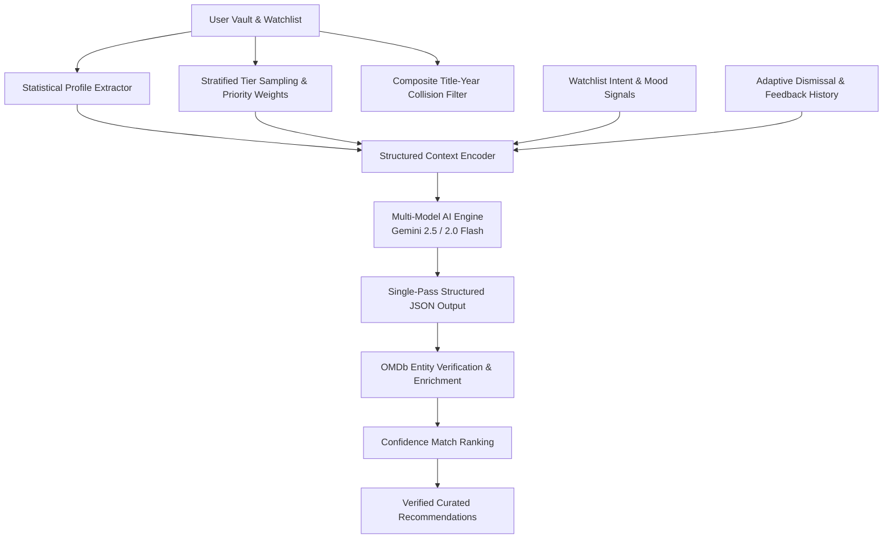

# CinemaVault

> **Streaming-Grade Personal Film Vault, Taste Intelligence & Cinema Analytics Platform**

CinemaVault is a high-performance web application designed for film tracking and curation. It provides comprehensive personal vault management, deep collection analytics, bidirectional Letterboxd CSV / JSON portability, real-time command-palette search, and an AI recommendation engine powered by Google Gemini and OMDb API.


---

## 🎨 Design System & Architecture

CinemaVault is engineered with a **content-first, streaming-platform design system**. The interface prioritizes clean typography, neutral surface hierarchies, and micro-interactions without visual clutter.

### Key Architectural & Design Principles
- **Neutral Charcoal Surface System**: Structured multi-tier surface elevation (`--bg: #0b0b0c`, `--surface-1: #141416`, `--surface-2: #1c1d20`, `--surface-3: #242528`) paired with subtle hairline dividers (`rgba(255, 255, 255, 0.08)`).
- **Curated Vault Brass Accent**: High-contrast brand accent (`#e2b13c`) applied selectively to interactive focus rings, active navigation indicators, and rating stars.
- **Editorial Typography**: Typography powered by **Inter** with tabular font figures for ratings, runtimes, and statistical telemetry.
- **Featured Spotlight Billboard**: Dynamic hero showcase highlighting acclaimed cinema titles with synchronized backdrop art, runtime metadata, storyline overviews, and instant vault actions.
- **Command-Palette Search (`Ctrl + K` / `Cmd + K`)**: Global modal search providing debounced OMDb queries, title/year filtering, 40×60 thumbnail previews, and keyboard navigation.
- **Personal Vault & Analytics Studio**:
  - Multi-criteria filtering by genre, title, release year, runtime, and user rating.
  - Dual layout switcher (Criterion-style responsive card grid and tabular list view).
  - Computed telemetry: total watch time (days, hours, minutes), rating delta against IMDb, score distribution histograms, and director/actor milestones.
  - Floating batch actions toolbar (`VaultBulkBar`) for multi-select deletion and queue transfers.
- **Bidirectional Data Portability**: Letterboxd-compatible CSV import/export, general CSV backup, and structured JSON vault exports with conflict-free merge and overwrite modes.
- **Hardware-Accelerated Motion**: Framer Motion spring physics for page transitions, tab underlines, and modal interactions with full `prefers-reduced-motion` compliance.

---

## 🧠 Recommendation Engine & Data Pipeline

CinemaVault combines deterministic statistical profiling with generative AI re-ranking to deliver grounded, relevant film recommendations.



### Core Algorithms & Data Integrity Measures

| Module / Technique | Implementation | Description |
| :--- | :--- | :--- |
| **Composite Collision Prevention** | `watchedKeySet` & `watchlistKeySet` | Tracks composite keys (`title::year`) alongside `imdbID` to distinguish remakes and franchise entries with identical titles. |
| **Statistical Taste Profiling** | `buildTasteAnalytics` | Computes mean ratings, top genre affinity percentages, and director leaderboards before constructing AI prompts. |
| **Stratified Tier Sampling** | `getMovieRecommendations` | Preserves **Elite Anchors (9–10/10)**, samples **Supporting Titles (7–8/10)**, captures **Disliked Anti-Patterns (≤ 5/10)**, and prioritizes recent viewing history. |
| **Adaptive Feedback Loop** | `aiFeedbackLog` & `handleDismiss` | Records user dismissals (*"Too slow"*, *"Not my genre"*, *"Already seen"*) to dynamically penalize matching traits in future recommendations. |
| **Multi-Model Failover Routing** | `MODELS` Failover Pipeline | Implements an automated failover chain (`gemini-2.5-flash` → `gemini-2.0-flash`) ensuring high availability under rate limits. |
| **OMDb Data Enrichment** | `fetchRealOMDBData` | Fetches verified metadata, IMDb vote counts, and official artwork for all suggestions, with automatic title-only retry fallbacks. |
| **Concurrent Batch Import** | `BackupManagerModal` | Employs chunked asynchronous batching (`BATCH_SIZE = 4`) to accelerate Letterboxd CSV imports by over 75%. |
| **Domain-Bounded AI Companion** | `sendChatMessage` | Interactive film companion restricted to cinema discourse, referencing user viewing history and outputting structured film cards. |

---

## 🛠️ Tech Stack

| Category | Technology |
| :--- | :--- |
| **Framework** | [React 18](https://react.dev/) |
| **Build Tool** | [Vite 5](https://vitejs.dev/) |
| **Routing** | [React Router v6](https://reactrouter.com/) |
| **Styling** | [Tailwind CSS v4](https://tailwindcss.com/) & Custom Design Tokens |
| **AI SDK** | [Google Gen AI SDK](https://ai.google.dev/) (`@google/genai`) |
| **Data Source** | [OMDb API](http://www.omdbapi.com/) |
| **Motion & Animation** | [Framer Motion](https://www.framer.com/motion/) |
| **Icons** | [Lucide React](https://lucide.dev/) |

---

## 🚀 Getting Started

### 1. Prerequisites
- **Node.js** (v18 or higher recommended)
- **OMDb API Key**: Free key from [omdbapi.com](http://www.omdbapi.com/apikey.aspx)
- **Google Gemini API Key**: API key from [Google AI Studio](https://aistudio.google.com/)
- **TMDB API Key (Optional)**: Key from [themoviedb.org](https://www.themoviedb.org/documentation/api) to enable real-time TMDB candidate retrieval and streaming-grade poster CDN integration.

### 2. Installation
```bash
git clone https://github.com/khuzaima175/React-Movie-Original.git
cd movie-ratings
npm install
```

### 3. Environment Configuration
Create a `.env` file in the project root:
```env
VITE_OMDB_KEY=your_omdb_api_key_here
VITE_GEMINI_KEY=your_gemini_api_key_here
VITE_TMDB_KEY=your_tmdb_api_key_here
```

### 4. Development Server
```bash
npm start
```
The application will launch on `http://localhost:3000`.

### 5. Production Build
```bash
npm run build
npm run serve
```

---

## 📁 Project Structure

```text
movie-ratings/
├── assets/                 # Documentation assets and screenshots
├── public/                 # Static web assets and icons
├── src/
│   ├── components/         # Application components
│   │   ├── ui/             # Core UI primitives (Button, Modal, Tabs, etc.)
│   │   ├── AIChat.jsx      # Conversational film companion
│   │   ├── HeroBillboard.jsx
│   │   ├── MovieCard.jsx
│   │   ├── MovieCarouselRow.jsx
│   │   ├── MovieDetails.jsx
│   │   ├── MovieRecommendations.jsx
│   │   ├── NavBar.jsx
│   │   ├── RandomPicker.jsx
│   │   ├── SearchModal.jsx
│   │   └── VaultBanner.jsx
│   ├── context/            # Global AppContext state & storage eviction
│   ├── hooks/              # Custom utility hooks (useDebounce)
│   ├── pages/              # Route views (Dashboard, Vault, AIPage, MoviePage)
│   ├── services/           # AI services & OMDb integrations
│   ├── motion.js           # Standardized Framer Motion curves & presets
│   ├── index.css           # Global design tokens and layout styling
│   ├── App.jsx             # Shell architecture, router, and modal coordinator
│   └── index.jsx           # Application entrypoint
├── package.json
└── README.md
```

---

## 📜 Author & License

Developed by **[Khuzaima](https://github.com/khuzaima175)**.
Released under the MIT License.