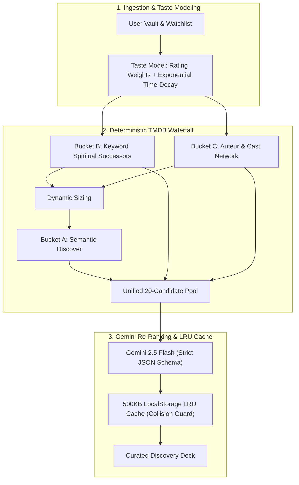

# CinemaVault

<div align="center">


### Personal Film Vault, Hybrid Recommendation Engine & Cinema Analytics

[](https://react.dev/)
[](https://vitejs.dev/)
[](https://ai.google.dev/)
[](https://developer.themoviedb.org/)
[](http://www.omdbapi.com/)
[](https://tailwindcss.com/)
[](LICENSE)

</div>

---

## Overview

**CinemaVault** is a client-side film logging, discovery, and analytics application built with React, Vite, and Tailwind CSS. It replaces naive generative guessing with a **two-stage hybrid recommendation pipeline**: deterministic 3-bucket candidate retrieval from TMDB coupled with contextual re-ranking via Google Gemini 2.5 Flash.

> 📖 **Looking for the deep technical breakdown?**  
> Check out the complete [Architecture & Mathematics Specification (ARCHITECTURE.md)](./ARCHITECTURE.md) for full mathematical derivations, taste profile vector formulas, and waterfall algorithms.

---

## Key Features

- **Hybrid Recommendation Pipeline**: TMDB 3-bucket waterfall candidate harvesting (keyword spiritual successors, auteur networks, and semantic discovery) re-ranked by Google Gemini with strict JSON schemas.
- **Mathematical Taste Vectors**: Continuous rating weights ($W_{\text{base}}$), exponential recency time-decay ($e^{-\lambda \cdot \Delta t}$), and surgical negative keyword trope exclusions.
- **Universal Streaming Access**: Unrestricted global discovery across cinema history, with optional filtering across 11 major streaming platforms and 15 country regions.
- **Zero-CLS Trailer Portal**: Portal-mounted responsive 16:9 YouTube trailer overlay with keyboard `ESC` dismissal and backdrop blur.
- **Telemetry Analytics Studio**: Rating Delta Histograms comparing your scores to IMDb baselines, total watch time metrics, and score distributions.
- **Two-Way Portability**: Full JSON database export and bidirectional Letterboxd CSV import/export.
- **Spotlight Command Palette (`Cmd + K` / `Ctrl + K`)**: Debounced live search querying the complete OMDb database with keyboard navigation.

---

## Architecture at a Glance



---

## Getting Started

### 1. Prerequisites
- **Node.js** (v18.0.0 or higher)
- **API Keys**:
  - [OMDb API Key](http://www.omdbapi.com/apikey.aspx) (Metadata and search)
  - [Google Gemini API Key](https://aistudio.google.com/) (LLM re-ranking)
  - [TMDB API Key](https://www.themoviedb.org/documentation/api) (Candidate harvesting & watch providers)

### 2. Installation
```bash
git clone https://github.com/khuzaima175/React-Movie-Original.git
cd movie-ratings
npm install
```

### 3. Environment Setup
Create a `.env` file in the root directory:
```env
VITE_OMDB_KEY=your_omdb_key_here
VITE_GEMINI_KEY=your_gemini_key_here
VITE_TMDB_KEY=your_tmdb_key_here
```

### 4. Development & Build
```bash
# Start local development server
npm start

# Build production bundle
npm run build

# Preview production build locally
npm run serve
```

---

## Technology Stack

| Layer | Technology | Purpose |
| :--- | :--- | :--- |
| **Frontend Framework** | [React 18.3](https://react.dev/) | Component architecture, state hooks & context |
| **Build & Tooling** | [Vite 5.4](https://vitejs.dev/) | Lightning-fast HMR and Rollup bundling |
| **Routing** | [React Router v6](https://reactrouter.com/) | Client-side routing and deep-linking |
| **Styling** | [Tailwind CSS v4](https://tailwindcss.com/) / CSS | Design tokens and utility architecture |
| **Motion Engine** | [Framer Motion](https://www.framer.com/motion/) | Spring physics and accessible modal transitions |
| **Primary AI Model** | [Google Gemini 2.5 Flash](https://ai.google.dev/) | Candidate re-ranking with strict JSON schema |
| **Catalog Retrieval** | [TMDB API v3](https://developer.themoviedb.org/) | Deterministic 3-Bucket waterfall queries & providers |
| **Metadata API** | [OMDb API](http://www.omdbapi.com/) | IMDb ratings, Metascores & movie metadata |
| **Icons** | [Lucide React](https://lucide.dev/) | UI vector icons |

---

## Architecture & Security Notes

- **Client-Side Storage**: All user data (ratings, reviews, watchlists, timestamps) is stored locally in the browser's `localStorage`. No remote tracking or database setup is required.
- **API Key Security**: In this standalone frontend application, `VITE_*` keys are inlined into the client bundle at build time. For a multi-user public production deployment with private quotas, API calls should be proxied through a lightweight backend (e.g. Cloudflare Workers, Next.js API routes, or Express).
- **Cache Management**: Recommendations are cached in `localStorage` under a 500KB cap with timestamp-based LRU eviction and real-time ID collision filtering against newly logged vault titles.

---

## Documentation

- [Detailed Architecture & Technical Specification (ARCHITECTURE.md)](./ARCHITECTURE.md)
- [Component & Feature Specification (SPEC.md)](./SPEC.md)

---

## License

This project is licensed under the **MIT License** — see the [LICENSE](LICENSE) file for details.

Developed with precision by **[Khuzaima](https://github.com/khuzaima175)**.