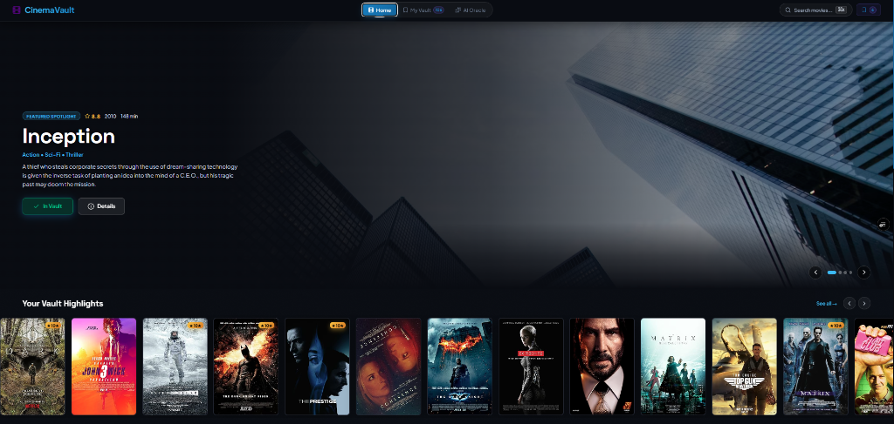

# 🎬 CinemaVault

> **The Ultimate Cinematic Vault & AI-Powered Movie Companion**

CinemaVault is a high-performance, feature-rich React application designed for movie enthusiasts. Search global film databases, manage your personal watched history and watchlist, explore deep vault analytics, and consult the Google Gemini AI Oracle for tailored film recommendations—all wrapped in a sleek, cinematic glassmorphism interface.



---

## ✨ Key Features

- 🍿 **Featured Spotlight Hero**: Immersive dynamic showcase hero banner displaying detailed metadata, backdrop art, IMDb ratings, and quick vault action toggles.
- 🤖 **AI Oracle (Gemini Integration)**: Smart AI recommender powered by `@google/genai`. Get personalized movie suggestions based on genre, mood, directors, or custom interactive prompts.
- 🏛️ **Personal Movie Vault**: Manage your **Watched** films and **Watchlist** queue with ease. Add custom user ratings, notes, favorite markers, and tags.
- 🔍 **Command-Palette Search**: Global quick-search modal accessible via keyboard shortcut (`Ctrl + K` or `Cmd + K`) with real-time debounced OMDb API queries.
- 📊 **Deep Vault Analytics**: View comprehensive statistics on your cinematic journey, including total watch time (hours/minutes), average rating, genre distributions, and favorite directors.
- 🎲 **Watchlist Randomizer**: Can't decide what to watch tonight? Use the interactive random picker to select a random title from your saved collection.
- 💾 **Data Export & Backup**: Full JSON import/export capabilities so your personal movie collection remains safe and portable.
- 🎨 **Cinematic Glassmorphism UI**: Built with dark-mode aesthetic principles, sleek glow highlights, smooth Framer Motion transitions, and Lucide React icons.

---

## 🛠️ Tech Stack

| Category | Technology |
| :--- | :--- |
| **Framework** | [React 18](https://react.dev/) with [Vite 5](https://vitejs.dev/) |
| **Routing** | [React Router v6](https://reactrouter.com/) |
| **AI Engine** | [Google Gemini API](https://ai.google.dev/) (`@google/genai`) |
| **Data Source** | [OMDb API](http://www.omdbapi.com/) |
| **Animations** | [Framer Motion](https://www.framer.com/motion/) |
| **Styling** | Tailwind CSS & Modern Custom CSS Variables |
| **Icons** | [Lucide React](https://lucide.dev/) |

---

## 🚀 Getting Started

### 1. Prerequisites

Make sure you have [Node.js](https://nodejs.org/) (v16 or higher) installed. You will also need API keys for:
- **OMDb API**: Get a free key at [omdbapi.com](http://www.omdbapi.com/apikey.aspx)
- **Google Gemini API**: Get an API key at [Google AI Studio](https://aistudio.google.com/)

### 2. Installation

Clone the repository and install project dependencies:

```bash
git clone https://github.com/khuzaima175/React-Movie-Original.git
cd movie-ratings
npm install
```

### 3. Environment Configuration

Create a `.env` file in the root directory (or copy from `.env.example`):

```env
VITE_OMDB_KEY=your_omdb_api_key_here
VITE_GEMINI_KEY=your_gemini_api_key_here
```

### 4. Run Development Server

Start the Vite development server:

```bash
npm start
```

Open `http://localhost:5173` in your browser to explore CinemaVault!

### 5. Build for Production

To create an optimized production build:

```bash
npm run build
```

Preview the production build locally:

```bash
npm run serve
```

---

## 📁 Project Structure

```text
movie-ratings/
├── assets/                 # Static documentation assets (screenshots, images)
├── public/                 # Web assets & favicon
├── src/
│   ├── components/         # Reusable UI components (NavBar, HeroBillboard, MovieCard, SearchModal, etc.)
│   ├── context/            # Global AppContext state management
│   ├── hooks/              # Custom React hooks (useMovies, useLocalStorageState, etc.)
│   ├── pages/              # Application views (DashboardPage, VaultPage, AIPage, MoviePage)
│   ├── services/           # External API integrations (geminiService, omdbService)
│   ├── App.jsx             # Router layout and main app root
│   ├── index.css           # Design tokens, keyframe animations, & Tailwind utilities
│   └── index.jsx           # React DOM entrypoint
├── .env.example            # Sample environment file configuration
├── package.json            # Dependencies and scripts
└── README.md               # Project documentation
```

---

## 📜 License & Acknowledgments

Built with ❤️ by [Khuzaima](https://github.com/khuzaima175)

If you find CinemaVault helpful, give it a ⭐️ on GitHub!