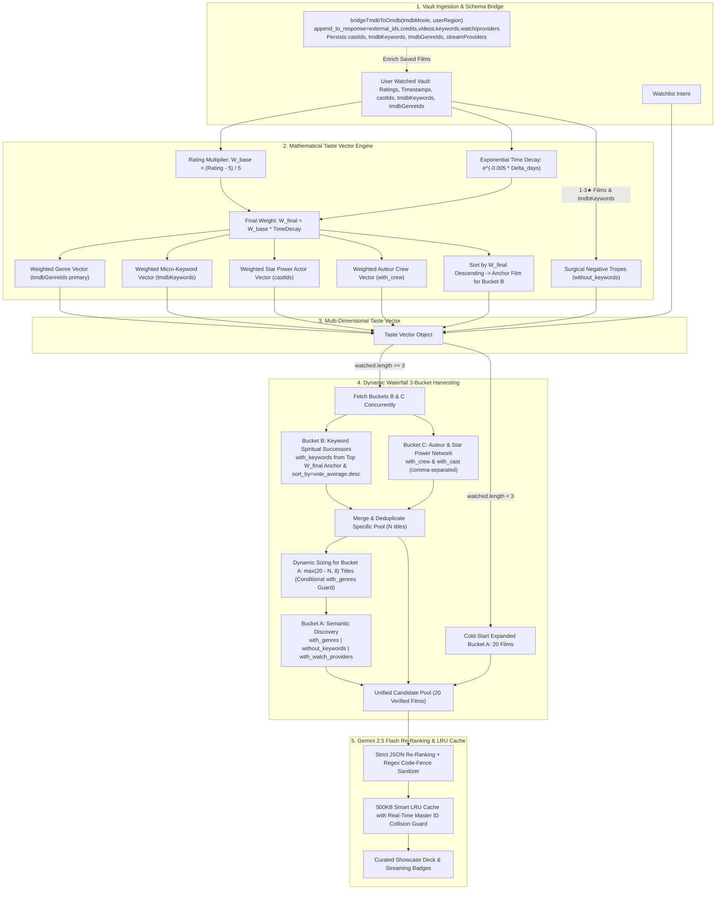

# CinemaVault

<div align="center">


### Streaming-Grade Personal Film Vault, Taste Intelligence Engine & Cinema Analytics Studio

[](https://react.dev/)
[](https://vitejs.dev/)
[](https://ai.google.dev/)
[](https://developer.themoviedb.org/)
[](http://www.omdbapi.com/)
[](https://tailwindcss.com/)
[](LICENSE)

</div>

---

## 📌 Executive Overview

**CinemaVault** is an enterprise-grade cinema vault, predictive taste intelligence engine, and deep film analytics platform. Engineered with a content-first luxury obsidian aesthetic, it replaces naive generative guessing with a **Deterministic 3-Bucket Waterfall Pipeline** from TMDB, a **Continuous Mathematical Taste Vector with Exponential Recency Decay**, and **Contextual Re-Ranking** powered by Google Gemini 3.7 & 2.5 Flash.

Whether organizing personal cinema archives, analyzing viewing habits through telemetry histograms, importing lifetime Letterboxd libraries, filtering by local streaming subscriptions, or watching trailers in a dedicated zero-CLS luxury portal, CinemaVault delivers instantaneous performance, strict schema verification, and 100% data sovereignty.

---

## 🧠 Algorithmic Recommendation Engine (v3.0 "God-Tier" Architecture)

Most AI-driven movie recommenders fail because they rely solely on raw generative text completion. Pure LLM recommendation models frequently suffer from **catalog hallucination** (inventing fake movie titles or cast), **stale echo chambers** (looping through the same 10 mainstream titles like *Inception* or *Interstellar*), and **rate-limit fragility**.

CinemaVault v3.0 completely eliminates these flaws through a **Multi-Dimensional Mathematical Vector Engine** and a **Deterministic 3-Bucket Waterfall Pipeline**:



---

### 📐 Mathematical Formulation

#### 1. Continuous Rating Multiplier ($W_{\text{base}}$)
CinemaVault abandons binary "liked/disliked" thresholds in favor of a continuous scale where every star rating precisely impacts recommendation weights:

$$W_{\text{base}} = \max\left(0, \frac{\text{Rating} - 5}{5}\right)$$

| Star Rating | $W_{\text{base}}$ Multiplier | Influence Tier |
| :---: | :---: | :--- |
| **10 / 10** | **1.00** | Masterpiece Anchor |
| **9 / 10** | **0.80** | Core Affinity Anchor |
| **8 / 10** | **0.60** | Strong Positive Affinity |
| **7 / 10** | **0.40** | Baseline Affinity |
| **$\le$ 5 / 10** | **0.00** | Disliked / Trope Ban Extractor |

#### 2. Exponential Recency Time-Decay ($W_{\text{final}}$)
To prevent stale favorites logged years ago from dominating recommendations over current obsessions, CinemaVault applies half-life exponential time decay ($\lambda = 0.005$, half-life $\approx 140\text{ days}$):

$$W_{\text{final}} = W_{\text{base}} \times e^{-\lambda \cdot \Delta t}$$

Where $\Delta t$ is the elapsed time in days since the movie was logged or watched.

#### 3. Temporally-Weighted Anchor Selection
The anchor movie for spiritual successor matching (Bucket B) is determined by sorting all $9–10\star$ films by $W_{\text{final}}$ descending. This guarantees the algorithm anchors to your **current cinematic obsession** rather than an arbitrary first entry.

#### 4. Surgical Negative Trope Extraction (`without_keywords`)
Rather than bludgeoning entire broad genres (which prevents recommending masterpieces like *The Dark Knight* just because you disliked a generic superhero movie), CinemaVault extracts granular micro-keywords from movies rated $\le 3\star$ (e.g. *slapstick*, *superhero*, *parody*) and excludes them via TMDB's `without_keywords` filter.

#### 5. Star-Power Actor Graphing & Auteur Crew Vectors
High-rated films ($\ge 8\star$) contribute their lead cast IDs to an aggregated star-power vector, passed to TMDB using comma-separated `,` OR syntax (`with_cast=67890,11122`), while elite directors and cinematographers are targeted via `with_crew`.

---

### 🌊 The 3-Bucket Waterfall Pipeline

1. **Bucket B: Keyword Spiritual Successors (Specific First)**
   - Queries TMDB `/discover/movie` using the micro-keywords of your top $W_{\text{final}}$ anchor movie.
   - Enforces `sort_by=vote_average.desc` and `vote_count.gte=100` to guarantee high-acclaim spiritual companions.
2. **Bucket C: Auteur & Star Power Network (Concurrent)**
   - Queries TMDB `/discover/movie` targeting the user's top recurring director or cinematographer (`with_crew`) and favorite lead actors (`with_cast`).
3. **Bucket A: Semantic Discover Engine (Dynamic Sizing)**
   - Dynamically sizes its harvest to $\max(20 - N, 8)$ titles where $N$ is the count from Buckets B & C.
   - Applies conditional `with_genres` guards, surgical `without_keywords`, and user streaming provider filters (`with_watch_providers`).
4. **Cold-Start Bypass Engine**
   - For accounts with $< 3$ rated films, automatically skips narrow keyword/crew buckets to harvest 20 diverse, high-reputation films across mood and watchlist genres.

---

### 🛡️ Enterprise Smart LRU Cache & Master ID Collision Guard

- **Master ID Cross-Referencing**: Smart Cache reads cross-reference `imdbID`, `tmdbId`, and local `id` across both Watched and Watchlist datasets. If $< 4$ unseen recommendations remain, the cache automatically busts and triggers a fresh fetch.
- **500KB LRU Eviction Manager**: Enforces a strict 500KB local storage ceiling with automatic timestamp-based least-recently-used eviction.
- **Resilient Regex Code-Fence Parser (`sanitizeAndParseJSON`)**: Immune to LLM markdown formatting variations (` ```json ... ``` `).
- **Automated LLM Failover**: Chains `gemini-3.7-flash` $\to$ `gemini-2.5-flash` $\to$ `gemini-2.0-flash` $\to$ **Deterministic TMDB Fallback**.

---

## ✨ Feature Tour

### 🗄️ Personal Vault & Telemetry Analytics Studio
- **Multi-Dimensional Filtering**: Instant search and filtering by genre, release year, runtime, and star rating.
- **Dual Display Modes**: Switch between Criterion-style responsive poster grid and dense tabular list view.
- **Live Vault Telemetry**:
  - Total watch time calculation (Days, Hours, Minutes).
  - Rating Delta Histogram comparing your ratings against the global IMDb baseline.
  - Score distribution charts (1–10 star breakdowns).
  - Director and Actor milestone leaderboards.
- **Floating Batch Operations (`VaultBulkBar`)**: Multi-select movies for bulk queue transfer or batch deletion.

### 🎬 Luxury Zero-CLS Trailer Portal (`<TrailerModal />`)
- Portal-mounted modal dialog with ultra-smooth 60fps animations via Framer Motion.
- Direct 16:9 YouTube player embed with `autoplay=1`, `modestbranding=1`, and background blur.
- Full keyboard accessibility with `ESC` dismissal and backdrop click handling.

### 📺 Universal Streaming Intelligence & Global Cinema Engine
- **"🌐 All Platforms / Universal Access" Mode**: Active by default — liberates the recommendation pipeline from single-platform walls, querying the complete global archive of cinema across Criterion, festival masterworks, indie releases, theatrical epics, and all streaming services.
- **Granular Provider Subscriptions**: Surgical filtering across **11 major networks**:
  - 🔴 Netflix
  - 📦 Amazon Prime Video
  - ✨ Disney+
  - 🟣 Max (HBO)
  - 🍏 Apple TV+
  - 🟢 Hulu
  - 🏔️ Paramount+
  - 🦚 Peacock
  - 🏛️ Criterion Channel
  - 📺 Tubi (Free)
  - ⚡ Pluto TV (Free)
  - 🎬 Freevee (Free)
- **🌍 Worldwide / Multi-Region Intelligence**:
  - Worldwide mode removes territorial lockouts, allowing films from **Japan, South Korea, France, Italy, Spain, India, Germany, the UK, Scandinavia, and Latin America** to surface naturally based on artistic synergy.
  - Multi-country selector supporting **15 regions** (🇺🇸 US, 🇬🇧 UK, 🇨🇦 Canada, 🇦🇺 Australia, 🇯🇵 Japan, 🇰🇷 South Korea, 🇫🇷 France, 🇩🇪 Germany, 🇪🇸 Spain, 🇮🇹 Italy, 🇮🇳 India, 🇧🇷 Brazil, 🇲🇽 Mexico, 🇸🇪 Sweden).
  - Robust catalog fallback: When Worldwide mode is paired with specific streaming subscriptions, queries bind to the primary global availability baseline with clear UI provenance.
- **Visual Provider Badges**: Real-time stream badges embedded on movie cards and cinematic breakdown drawers.

### 🛰️ Animated Intelligence Loading Theater
- Hardware-accelerated **orbital radar core** with dual counter-rotating dashed rings and ambient pulse glows.
- Real-time **stratified checklist** tracking personal vault ingestion, TMDB 3-bucket waterfall querying, and Gemini structured re-ranking.

### 🔍 Spotlight Command Search (`Cmd + K` / `Ctrl + K`)
- High-speed global spotlight palette inspired by macOS Spotlight and Linear.
- Debounced live search querying the complete OMDb database with instant poster thumbnails.
- Full keyboard navigation support (`↑` / `↓` arrows, `↵ Enter` to inspect, `ESC` to close).
- Trending search chips and recent inquiry history.

### 🔄 Bidirectional Data Portability & Letterboxd Sync
- **Full JSON Vault Archive**: Complete database dump with user ratings, custom reviews, watchlists, timestamps, and metadata.
- **Spreadsheet CSV Export**: Clean, tabular CSV format compatible with Microsoft Excel, Google Sheets, and Notion databases.
- **Letterboxd Two-Way Portability**:
  - Export ratings in native Letterboxd CSV format (`Title, Year, Rating10`).
  - High-speed Letterboxd CSV importer with chunked asynchronous OMDb batching (`BATCH_SIZE = 4`) to import hundreds of ratings in seconds.
  - Non-destructive **Merge Mode** and clean **Overwrite Mode**.

### 🎲 Vault Roulette (Random Film Picker)
- High-energy cinema roulette with physics-eased mechanical ticker animations.
- Filter roulette spins by specific genres or choose randomly from your unviewed Watchlist.
- Instant action triggers: log directly as watched, rate, or view full cinematic breakdown.

### 🌌 Cold-Start Vibe Matrix
- Instant curated exploration for new accounts with 0 logged ratings.
- 8 hand-crafted cinematic vibe vectors (e.g. *Cyberpunk Noir*, *A24 Mind-Bending*, *Cozy Feel-Good*, *Slow-Burn Psychological*, *90s Cult Thrillers*).

### 💬 Context-Aware AI Film Companion
- Interactive conversational cinema assistant powered by Google Gemini.
- Bounded to film discourse with access to your personal watch history and rating habits.
- Renders structured interactive film cards directly inside the conversation stream.

---

## 🎨 Design System: Luxury Obsidian & Vault Brass

CinemaVault is designed with a streaming-grade interface inspired by Apple TV, Criterion Channel, and Linear:

```text
--bg:          #0b0b0c  (Deep Space Obsidian)
--surface-1:   #141416  (Elevated Charcoal Card Surface)
--surface-2:   #1c1d20  (Interactive Component Surface)
--surface-3:   #242528  (Pill & Control Surface)
--accent:      #e2b13c  (Curated Vault Brass Gold)
--border:      rgba(255, 255, 255, 0.08) (Subtle Hairline Divider)
```

- **Fluid Typography**: Dynamic scaling powered by **Inter** with tabular monospace figures for numerical telemetry.
- **Micro-Interactions**: Hardware-accelerated transitions via Framer Motion with full `prefers-reduced-motion` accessibility support.
- **Zero Layout Shift**: Fixed-aspect poster skeletons and image fallback states.

---

## 🛠️ Technology Stack

| Layer | Technology | Purpose |
| :--- | :--- | :--- |
| **Frontend Framework** | [React 18.3](https://react.dev/) | Component architecture, state management & hooks |
| **Build & Tooling** | [Vite 5.4](https://vitejs.dev/) | Lightning-fast HMR and optimized production bundling |
| **Routing** | [React Router v6](https://reactrouter.com/) | Client-side routing and deep-linking |
| **Styling** | [Tailwind CSS v4](https://tailwindcss.com/) | Design tokens, utility architecture & Vanilla CSS |
| **Motion Engine** | [Framer Motion](https://www.framer.com/motion/) | Spring physics, layout animations & modal gestures |
| **Primary AI Model** | [Google Gemini 3.7 / 2.5 Flash](https://ai.google.dev/) | Candidate re-ranking with strict JSON Schema output |
| **Failover AI Model** | [Google Gemini 2.0 Flash](https://ai.google.dev/) | Secondary high-throughput fallback LLM |
| **Catalog Retrieval** | [TMDB API v3](https://developer.themoviedb.org/) | Deterministic 3-Bucket Waterfall queries & provider IDs |
| **Enrichment Data** | [OMDb API](http://www.omdbapi.com/) | IMDb ratings, Metascores, box office & poster assets |
| **Icons** | [Lucide React](https://lucide.dev/) | Vector UI iconography |

---

## 🚀 Getting Started

### 1. Prerequisites
- **Node.js** (v18.0.0 or higher recommended)
- **npm** or **yarn** / **pnpm**
- **OMDb API Key**: Get a free API key from [omdbapi.com](http://www.omdbapi.com/apikey.aspx)
- **Google Gemini API Key**: Get an API key from [Google AI Studio](https://aistudio.google.com/)
- **TMDB API Key (Recommended)**: Get a free v3 API key from [themoviedb.org](https://www.themoviedb.org/documentation/api)

### 2. Clone and Install Dependencies
```bash
git clone https://github.com/khuzaima175/React-Movie-Original.git
cd movie-ratings
npm install
```

### 3. Environment Variables Setup
Create a `.env` file in the root directory:
```env
# OMDb API Key for metadata and search
VITE_OMDB_KEY=your_omdb_key_here

# Google Gemini API Key for recommendation re-ranking & AI companion
VITE_GEMINI_KEY=your_gemini_key_here

# TMDB API Key for deterministic candidate discovery & watch providers
VITE_TMDB_KEY=your_tmdb_key_here
```

### 4. Run Development Server
```bash
npm start
```
The application will be accessible at `http://localhost:3000`.

### 5. Production Build & Validation
```bash
npm run build
npm run serve
```

---

## 📂 Project Architecture

```text
movie-ratings/
├── public/                     # Static icons, manifest, and assets
├── src/
│   ├── components/             # Reusable UI & Feature components
│   │   ├── ui/                 # Design System Primitives
│   │   │   ├── Button.jsx      # Vault Button variants (Primary, Ghost, Danger)
│   │   │   ├── Card.jsx        # Glassmorphic surface containers
│   │   │   ├── Modal.jsx       # Studio-grade accessible dialog portal
│   │   │   ├── Tabs.jsx        # Segmented pill control switcher
│   │   │   └── Tooltip.jsx     # Positioned metadata tooltips
│   │   ├── AIChat.jsx          # Context-aware cinema discourse companion
│   │   ├── BackupManagerModal.jsx # 3-tier export grid & Letterboxd CSV importer
│   │   ├── HeroBillboard.jsx   # Spotlight backdrop billboard with trailer preview
│   │   ├── MovieCard.jsx       # Responsive poster card with quick actions
│   │   ├── MovieCarouselRow.jsx# Smooth horizontal carousel slider
│   │   ├── MovieDetails.jsx    # Full-page cinematic breakdown & cast reel
│   │   ├── MovieRecommendations.jsx # God-Tier 3-bucket recommendation interface
│   │   ├── NavBar.jsx          # Sticky glass navigation & spotlight launcher
│   │   ├── PosterImage.jsx     # Lazy-loaded image with shimmer placeholder
│   │   ├── RandomPicker.jsx    # Physics-eased Vault Roulette reel
│   │   ├── SearchModal.jsx     # Universal Command Palette (Cmd+K)
│   │   ├── Toast.jsx           # Ephemeral action feedback alerts
│   │   ├── TrailerModal.jsx    # Luxury zero-CLS YouTube trailer portal
│   │   ├── VaultAnalytics.jsx  # Watch time telemetry & score delta charts
│   │   └── VaultBulkBar.jsx    # Multi-item batch management bar
│   ├── context/
│   │   └── AppContext.jsx      # Global vault state, storage sync & LRU cache eviction
│   ├── hooks/
│   │   └── useDebounce.js      # Input debounce utility for search APIs
│   ├── pages/
│   │   ├── DashboardPage.jsx   # Curated billboard & recommendation hubs
│   │   ├── VaultPage.jsx       # Personal collection, watchlist & analytics
│   │   ├── AIPage.jsx          # Dedicated AI exploration & chat center
│   │   └── MoviePage.jsx       # Canonical film detail routing view
│   ├── services/
│   │   ├── geminiService.js    # Gemini re-ranking, LRU cache & chat client
│   │   ├── tmdbService.js      # 3-Bucket Waterfall engine, taste profiling & schema bridge
│   │   └── omdbService.js      # OMDb API client & fallbacks
│   ├── motion.js               # Framer Motion spring physics configurations
│   ├── index.css               # Design system tokens, utilities & animations
│   ├── App.jsx                 # Application shell, router & modal coordinator
│   └── index.jsx               # React DOM root entrypoint
├── .env.example                # Template environment variables
├── package.json                # Project dependencies & build scripts
├── vite.config.js              # Vite configuration & dev server proxy
└── README.md                   # Technical documentation
```

---

## 🔒 Data Privacy & Offline Integrity

CinemaVault values **privacy and zero lock-in**:
- **100% Client-Side State**: All ratings, notes, custom tags, and watch history are stored in `localStorage` in the user's browser.
- **Zero Tracking**: No telemetry or personal movie data is sold, monetized, or logged on remote servers.
- **Unrestricted Data Portability**: Export your complete vault at any time via standardized JSON or Letterboxd-ready CSV formats.

---

## 📄 License

This project is licensed under the **MIT License** — see the [LICENSE](LICENSE) file for details.

Developed with precision by **[Khuzaima](https://github.com/khuzaima175)**.