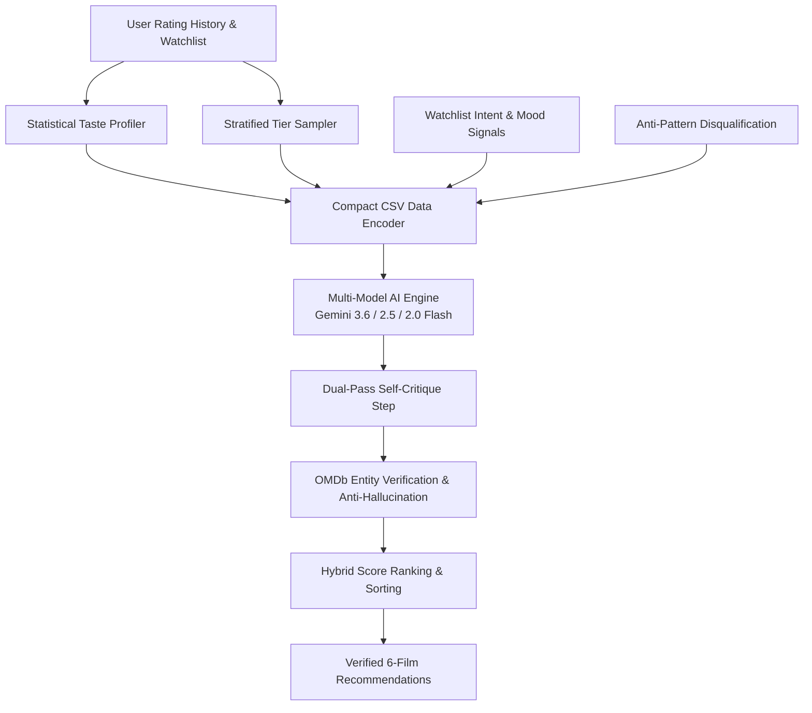

# 🎬 CinemaVault

> **The Ultimate Cinematic Vault & AI-Powered Movie Companion**

CinemaVault is a high-performance, feature-rich React application designed for movie enthusiasts. Search global film databases, manage your personal watched history and watchlist, explore deep vault analytics, and consult the Google Gemini AI Oracle for tailored film recommendations—all wrapped in a sleek, cinematic glassmorphism interface.


---

## 🎨 UI Elevation & Design Overhaul

CinemaVault features a complete UI redesign built to deliver a **luxurious, theatre-grade desktop and mobile experience**. The interface evolved from standard web lists into an atmospheric cinematic platform:

### 🌟 Key UI/UX Enhancements
- 💎 **Glassmorphism 3-Surface Elevation System**: Architected with strict CSS custom property design tokens (`--surface-base: #090c12`, `--surface-card: #131926`, `--surface-elevated: #1a2336`), cyan/blue glow accents (`#38bdf8`), and high-contrast typography using Google Fonts (**Space Grotesk** & **Plus Jakarta Sans**).
- 🌌 **Ambient Gradient Orbs & Film Grain Overlay**: Dynamic, floating ambient background blur orbs (`gradient-orb`) paired with a custom SVG fractal noise film-grain background overlay (`grid-pattern`) for a theater aesthetic.
- 🚀 **Executive Floating Pill Navigation**: Glassmorphic sticky header featuring segmented pill tab switches, real-time watchlist/watched count badges, and one-click quick-vault triggers.
- 🍿 **Featured Spotlight Hero Billboard**: Dynamic showcase banner highlighting top trending or featured titles with full backdrop art, IMDb ratings, genre tags, storyline summaries, and instant watched/watchlist action toggles.
- 📊 **Deep Vault Analytics Dashboard**: Comprehensive visual statistics featuring total cinematic watch time (converted to hours and minutes), average user score meter, genre distribution percentages, top directors leaderboard, and rating breakdown charts.
- 🔍 **Command-Palette Search (`Ctrl + K` / `Cmd + K`)**: Global instant-search modal supporting live debounced OMDb queries, title/year filtering, poster previews, and keyboard navigation.
- 📦 **Data Management & Bulk Action Suite**: Full JSON data import/export modal with integrity validation, alongside a bottom floating bulk actions bar (`VaultBulkBar`) for batch operations.
- 🎨 **Luxury SVG Fallback Posters**: Custom inline vector poster generator (`getFallbackPoster`) ensuring zero broken image layout shifts when posters are missing from remote APIs.
- ✨ **Framer Motion Micro-Animations**: Smooth page transitions, staggered item fade-ins (`fadeSlide`), scale-on-hover poster interactions, and responsive modal animations.

---

## 🧠 Recommendation System & AI Algorithms

CinemaVault employs an advanced **Hybrid AI & Statistical Recommendation Pipeline** engineered to eliminate hallucinated recommendations, penalize disliked movie traits, and deliver hyper-personalized film suggestions.



### 🔬 Core Algorithms Implemented

| Algorithm / Technique | Primary Module | Description & Technical Implementation |
| :--- | :--- | :--- |
| **1. Statistical Taste Profiling & Feature Vector Extraction** | [`buildTasteAnalytics`](file:///g:/Important%20Projects/movie-ratings/src/services/geminiService.jsx#L104) | Computes mean ratings, top genre distributions (% affinity across 7+ rated films), and top director leaderboards (filtered by minimum 2 films and calculated average rating) prior to AI context construction. |
| **2. Stratified Tier Sampling & Priority Anchor Weighting** | [`getMovieRecommendations`](file:///g:/Important%20Projects/movie-ratings/src/services/geminiService.jsx#L217) | When history exceeds 40 titles, an algorithm segments movies into distinct buckets: **Elite Anchors (9-10/10)** are priority-preserved uncapped, **Supporting (7-8/10)** are sampled up to 15 titles, and **Recency** samples the 10 most recent entries. |
| **3. Anti-Pattern & Disqualification Penalty Algorithm** | [`antiPatternSummary`](file:///g:/Important%20Projects/movie-ratings/src/services/geminiService.jsx#L257) | Isolates low-rated films (≤ 5/10) along with specific user criticism notes. Instructs the AI engine to strictly penalize and disqualify candidate films exhibiting similar structural or thematic flaws. |
| **4. Watchlist Implicit Intent Mining** | [`watchlistTitles`](file:///g:/Important%20Projects/movie-ratings/src/services/geminiService.jsx#L276) | Extracts titles in the user's watchlist as implicit curiosity vectors to infer genre/style preferences without recommending already-saved movies. |
| **5. Token-Efficient Compact CSV Data Encoding** | Prompt Vectorization | Encodes raw movie arrays into a tight, pipe-delimited CSV format (`Title|Year|Director|Writer|Genre|Rating|UserNote|PlotTheme`), reducing prompt token usage by ~60% while maintaining semantic clarity. |
| **6. Multi-Model Dynamic Fallback Routing** | [`MODELS` Routing](file:///g:/Important%20Projects/movie-ratings/src/services/geminiService.jsx#L389) | Implements an automated failover loop (`gemini-3.6-flash` → `gemini-2.5-flash` → `gemini-2.0-flash`). Guarantees recommendation delivery during high API load, model deprecation, or rate limiting. |
| **7. Dual-Pass LLM Self-Critique & Quality Verification** | [`critiquePrompt`](file:///g:/Important%20Projects/movie-ratings/src/services/geminiService.jsx#L426) | Performs a second-pass AI review step evaluating generated candidate recommendations against user anti-patterns and elite anchors. Adjusts confidence scores (0-100%) and appends caution warnings for low-confidence fits. |
| **8. OMDb Real-Data Verification & Anti-Hallucination** | [`fetchRealOMDBData`](file:///g:/Important%20Projects/movie-ratings/src/services/geminiService.jsx#L19) | Queries the live OMDb API for every AI-suggested title to overwrite hallucinated AI ratings with real IMDb ratings, IMDb vote counts, posters, and plots. Implements a Title+Year retry fallback without year constraint to handle release date mismatches. |
| **9. Deterministic Input Hashing & Caching** | [`generateInputHash`](file:///g:/Important%20Projects/movie-ratings/src/services/geminiService.jsx#L169) | Calculates a string fingerprint hash of watched ratings, notes, watchlist state, and selected mood to prevent redundant LLM generation calls. |
| **10. Hybrid Score Ranking & Dual-Tier Sorting** | Ranking Logic | Ranks output suggestions primarily by AI Match Score alignment (0-100%) and secondarily by live IMDb user ratings. |
| **11. Explainable AI Intelligence Generator** | [`getRecommendationExplanation`](file:///g:/Important%20Projects/movie-ratings/src/services/geminiExplanationService.jsx#L9) | Micro-explainer model comparing candidate films against the user's top 5 rated films to construct natural-language justifications (*"Because you liked [Movie A], you will love [Movie B]..."*). |
| **12. Context-Bounded Conversational Companion** | [`sendChatMessage`](file:///g:/Important%20Projects/movie-ratings/src/services/geminiChatService.jsx#L13) | Conversational cinema assistant with strict domain-bounding rules and watched-history context injection. |

---

## ✨ Key Features

- 🍿 **Featured Spotlight Hero**: Immersive dynamic showcase hero banner displaying detailed metadata, backdrop art, IMDb ratings, and quick vault action toggles.
- 🤖 **AI Oracle (Gemini Integration)**: Smart AI recommender powered by `@google/genai`. Get personalized movie suggestions based on genre, mood, directors, or custom interactive prompts.
- 🏛️ **Personal Movie Vault**: Manage your **Watched** films and **Watchlist** queue with ease. Add custom user ratings, notes, favorite markers, and tags.
- 🔍 **Command-Palette Search**: Global quick-search modal accessible via keyboard shortcut (`Ctrl + K` or `Cmd + K`) with real-time debounced OMDb API queries.
- 📊 **Deep Vault Analytics**: View comprehensive statistics on your cinematic journey, including total watch time (hours/minutes), average rating, genre distributions, and favorite directors.
- 🎲 **Watchlist Randomizer**: Can't decide what to watch tonight? Use the interactive random picker to select a random title from your saved collection.
- 💾 **Data Export & Backup**: Full JSON import/export capabilities so your personal movie collection remains safe and portable.
- 🎨 **Cinematic Glassmorphism UI**: Built with dark-mode aesthetic principles, sleek glow highlights, smooth Framer Motion transitions, and Lucide React icons.

---

## 🛠️ Tech Stack

| Category | Technology |
| :--- | :--- |
| **Framework** | [React 18](https://react.dev/) with [Vite 5](https://vitejs.dev/) |
| **Routing** | [React Router v6](https://reactrouter.com/) |
| **AI Engine** | [Google Gemini API](https://ai.google.dev/) (`@google/genai`) |
| **Data Source** | [OMDb API](http://www.omdbapi.com/) |
| **Animations** | [Framer Motion](https://www.framer.com/motion/) |
| **Styling** | Tailwind CSS & Modern Custom CSS Variables |
| **Icons** | [Lucide React](https://lucide.dev/) |

---

## 🚀 Getting Started

### 1. Prerequisites

Make sure you have [Node.js](https://nodejs.org/) (v16 or higher) installed. You will also need API keys for:
- **OMDb API**: Get a free key at [omdbapi.com](http://www.omdbapi.com/apikey.aspx)
- **Google Gemini API**: Get an API key at [Google AI Studio](https://aistudio.google.com/)

### 2. Installation

Clone the repository and install project dependencies:

```bash
git clone https://github.com/khuzaima175/React-Movie-Original.git
cd movie-ratings
npm install
```

### 3. Environment Configuration

Create a `.env` file in the root directory (or copy from `.env.example`):

```env
VITE_OMDB_KEY=your_omdb_api_key_here
VITE_GEMINI_KEY=your_gemini_api_key_here
```

### 4. Run Development Server

Start the Vite development server:

```bash
npm start
```

Open `http://localhost:5173` in your browser to explore CinemaVault!

### 5. Build for Production

To create an optimized production build:

```bash
npm run build
```

Preview the production build locally:

```bash
npm run serve
```

---

## 📁 Project Structure

```text
movie-ratings/
├── assets/                 # Static documentation assets (screenshots, images)
├── public/                 # Web assets & favicon
├── src/
│   ├── components/         # Reusable UI components (NavBar, HeroBillboard, MovieCard, SearchModal, etc.)
│   ├── context/            # Global AppContext state management
│   ├── hooks/              # Custom React hooks (useMovies, useLocalStorageState, etc.)
│   ├── pages/              # Application views (DashboardPage, VaultPage, AIPage, MoviePage)
│   ├── services/           # External API integrations (geminiService, omdbService)
│   ├── App.jsx             # Router layout and main app root
│   ├── index.css           # Design tokens, keyframe animations, & Tailwind utilities
│   └── index.jsx           # React DOM entrypoint
├── .env.example            # Sample environment file configuration
├── package.json            # Dependencies and scripts
└── README.md               # Project documentation
```

---

## 📜 License & Acknowledgments

Built with ❤️ by [Khuzaima](https://github.com/khuzaima175)

If you find CinemaVault helpful, give it a ⭐️ on GitHub!