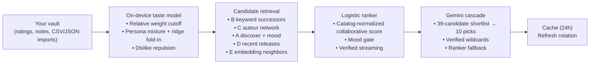

# CinemaVault

A local-first film tracker and recommender. It combines an on-device taste model, multi-bucket TMDB retrieval, and Gemini-based curation, with optional Supabase sync.

[](https://react.dev/)
[](https://vitejs.dev/)
[](./LOCAL_MODEL_GUIDE.md)
[](https://ai.google.dev/)
[](https://tailwindcss.com/)
[](https://www.framer.com/motion/)
[](./ARCHITECTURE.md#20-opt-in-multi-user-supabase-cloud-sync-postgres-rls-schema--merge-engine)

[Features](#features) · [Why CinemaVault](#why-cinemavault) · [How it works](#how-it-works) · [Local model](#local-model-and-verification) · [Quick start](#quick-start) · [Known limitations](#known-limitations)

---

## Why CinemaVault

Problems this project is built around:

- Browsing streaming services for a film to watch can take a long time.
- General AI chatbots often recommend the same mainstream titles, or invent films and release years.
- Math-based recommenders can struggle with old rating logs, bulk-imported Letterboxd backlogs that look like recent watches, and films released after the collaborative training data ends.
- Streaming availability depends on the viewer's country.
- Ratings are scattered across services, spreadsheets, and notes.

CinemaVault keeps your film log in your browser by default. It uses your ratings to build a local taste model, retrieves candidates from TMDB, ranks them with a deterministic model, and only then asks Gemini to choose and explain among already-verified titles.

---

## At a glance

| Area | What it does |
| :--- | :--- |
| Local taste model | 25,000-film collaborative embedding index (3,300,016 bytes, float16), per-user rating normalization, recency decay, persona mixtures, and a 64×64 ridge fold-in. Runs in the browser. |
| Recommendations | Five retrieval buckets, a calibrated logistic ranker, and 10 picks from a 39-candidate shortlist. Verified TMDB titles only. |
| Vibes | Six preset moods plus free-text "Match Vibe" queries such as "like Drive but quieter." |
| Gemini cascade | Ordered model fallback with error-specific cooldowns, plus a deterministic ranker fallback when no model responds. |
| Streaming | 12 services, 13 provider alias families, 15 regions. |
| Rating studio | 10-star stage, live percentile calibration, optional 4-aspect craft scores, and watch-session metadata. |
| Import and export | Letterboxd and CinemaVault CSV import, Schema v2 JSON backup, and a diff preview before applying. |
| Discovery | Discover rows, a filterable `/explore` workbench, and a first-visit taste deck. |
| Compare | Two to three films side by side, with shared cast, genres, and taste similarity. |
| Sync | Optional Supabase sign-in with Postgres row-level security. |
| Security | Serverless `/api/*` proxies keep API keys out of the browser bundle. |

---

## Features

### 1. Recommendation engine

Recommendations come from local math first. Gemini does not generate titles.

1. **Taste model.** Ratings are z-scored against each user's own distribution and decayed over time (about an 11.5-month half-life). Undated and bulk-imported entries get a 180-day prior. Positive taste is clustered into one to four personas, blended with a ridge fold-in vector, and disliked films push nearby candidates down.
2. **Candidate retrieval.** Five buckets run:
   - **Bucket B (keyword successors):** films sharing micro-keywords with your highest-rated anchor (rated 9 or higher).
   - **Bucket C (auteur network):** acclaimed films from your most-watched directors, cinematographers, composers, and writers.
   - **Bucket A (semantic discovery):** TMDB discover results filtered by loved genres, watchlist genres, mood, and regional streaming.
   - **Bucket D (recent releases):** films from the last 18 months with reasonable acclaim, capped at 12.
   - **Bucket E (embedding neighbors):** up to 30 unseen nearest neighbors from the local index, or 15 when an explicit mood is active.
3. **Ranking.** A 12-feature logistic ranker scores the pool. Under "Any Vibe," collaborative similarity is normalized against the whole catalog, and metadata is damped while collaborative signal is weak. Under an explicit mood, the ranker shifts weight toward genre fit and hard-gates candidates against the mood's rules. Display scores fall between 50 and 99 and preserve rank order.
4. **Curation.** The shortlist of 39 candidates (25 top-ranked, 8 releases from 2024–2026, 6 outliers) goes to Gemini with a prompt capped at 20,000 characters. Gemini picks 10 and may propose up to two extra titles. Each extra title must pass TMDB verification, the vault and watchlist exclusions, the streaming filter, and the mood gate before it appears.
5. **Fallback.** If every model fails or Gemini is unavailable, the top 10 ranker results are shown and labeled as ranker output.

Each pick includes "Because you rated" links to films in your vault. The Refresh button rotates through unseen candidates without repeats.

### 2. Vibes and free-text matching

- **Mind-Bending:** plot-driven and cerebral.
- **Dark Thriller:** tense, gritty, often neo-noir.
- **Fun Popcorn:** high-energy crowd pleasers.
- **Comfort Watch:** warm and rewatchable.
- **Hidden Gem:** acclaimed films with fewer than 2,000 TMDB votes.
- **Any Vibe:** the default, using your full taste profile.

Free-text queries such as "pre-2000 cozy comedy, no horror" are parsed into genre, exclusion, and year constraints. The parser runs offline with keyword rules and uses Gemini's fast model when available.

### 3. AI chat and "Discuss This Film"

- The chat uses your films rated 8 or higher, your notes, and any active taste rules.
- **Discuss This Film** on a movie page opens `/ai?tab=chat` with a pinned film context bar.
- Spoiler-safe mode is on by default for films you haven't watched. You can allow spoilers from the context bar.
- Film titles in replies appear as cards with details, trailer, and watchlist actions.
- Chat is limited to cinema topics.

### 4. Streaming availability

- Services: Netflix, Amazon Prime Video, Disney+, Max, Apple TV+, Hulu, Paramount+, Peacock, Criterion Channel, Tubi, Pluto TV, and Freevee.
- Provider alias families group ad-supported tiers, kids tiers, and channel versions (for example, Netflix Standard with Ads).
- Regions: GLOBAL, US, GB, CA, AU, JP, KR, FR, DE, ES, IT, IN, BR, MX, and SE.
- Recommendations and cache keys are region-specific.

### 5. Cinema Roulette

Pick a random film from your Watchlist or your Watched list, with an animated reveal and quick links to the trailer and synopsis.

### 6. Taste analytics

- **Rating delta:** your rating minus the IMDb rating for each film, grouped into five bands from "critical contrarian" to "strong favorite."
- **Screen time:** total runtime of watched films, shown in days, hours, and minutes.
- **Distribution:** exact 1–10 counts, including low ratings.

### 7. Rating studio

- A 10-star stage with a numeric readout and a tier label for each score.
- **Live calibration:** as you pick a score, the stage shows your percentile in the vault and up to two films rated the same or nearest.
- **Optional craft scores (1–5):** story, direction, performances, and visuals and sound.
- **Watch log:** format (streaming, theater, IMAX or Dolby, physical media), rewatch count, and watch date.
- **Notes and tags:** a short note and one-tap tags such as `#TightPacing` or `#WeakEnding`. Notes in Quick Rate are capped at 200 characters. Notes are passed to Gemini up to 180 characters.
- **Score effects:** a 10 sets an anchor for keyword matching. Scores of 4 and below feed negative keyword and embedding repulsion.

### 8. Filmography and person pages

Click any cast member or crew credit to open their filmography in an overlay, with department tabs, status filters, watchlist and rate actions, and your stats for their films. A full `/person/:id` page is also available.

### 9. CSV and data portability

- **Letterboxd import:** star glyphs (for example, ★★★★½) and 1–5 scales convert to the 10-point scale. Headers are matched by name.
- **Dates:** `Watched Date` takes priority over `Date`. Impossible dates such as 2026-02-30 are rejected. Timestamps more than 24 hours in the future are rejected.
- **Bulk-import guard:** if at least 10 logged dates cluster heavily (the top three days hold 30% or more of rows, or the span is under 14 days), they are treated as a bulk import and get the 180-day prior.
- **Rewatch handling:** duplicate diary rows collapse to the newest date. If the newest row has no rating, the most recent earlier rating is kept.
- **Backup:** Schema v2 JSON (includes region, providers, and taste rules), a CinemaVault CSV, and a Letterboxd-style CSV.
- **Import modes:** Merge and Update, Add New Only, or Replace Vault. A diff preview appears before anything changes.
- **Unrated rows** stay unrated. Missing ratings are never filled in.
- **Background backfill:** missing TMDB IDs, keywords, and cast are filled in gradually, skipping TV series.

### 10. Search and trailers

- `Cmd + K` (Mac) or `Ctrl + K` (Windows and Linux), or `/` outside text fields, opens search.
- Search queries OMDb and TMDB in parallel, merges results, and marks films already in your vault.
- Trailers prefer an official English trailer, then other trailers, then teasers. Playback opens in a modal or on YouTube. Films with no trailer data link to a YouTube search.

### 11. Interface

- Dark, neutral palette with brass accents.
- Discover hero carousel that pauses on hover.
- Motion respects `prefers-reduced-motion`.
- Toast notifications with Undo for deletions.

### 12. First-visit taste deck

On a first visit with fewer than three rated films, a 30-film deck opens. It mixes genres, hides films already watched, and accepts ratings or watchlist saves. It stays available from the menu as "Taste Calibration (30)."

### 13. Discover hub

- Rows of unwatched films, with films already in your vault or watchlist excluded across all rows.
- A filterable "All Films" grid, 24 posters per page.
- Offline, the app shows built-in fallback rows.

### 14. Explore workbench (`/explore`)

- Filters: genres (include and exclude), decades or custom years, runtime, minimum rating, minimum votes, language, country, keyword and person search, streaming services, and hide-watched or hide-watchlist.
- Every filter is stored in the URL, so searches can be shared and reloaded.
- Removable filter chips show active filters.
- Clicking a genre or keyword on a movie page opens `/explore` with that filter applied.

### 15. Compare (`/compare`)

- Add up to three films with the Compare button on any card or detail page. A dock at the bottom of the screen tracks them, and the list is stored in `localStorage`.
- The comparison table highlights the best value in each row. It covers IMDb, Rotten Tomatoes, Metascore, TMDB score, runtime, budget, box office, return on budget, your rating, and taste similarity.
- Shared cast and crew link to filmographies. Shared genres and keywords link to `/explore`. Pairwise similarity bars come from the local embedding index.
- Comparison URLs can be copied and shared.

### 16. Cloud sync and secure API proxies

- **Local first:** the app works fully offline with no sign-in.
- **Optional sign-in:** if you configure Supabase, you can sign in by email and sync across devices. Rows are protected by row-level security. Merging gives watched entries priority over watchlist entries and prevents deleted items from coming back.
- **Proxies:** `GEMINI_API_KEY`, `TMDB_API_KEY`, and `OMDB_API_KEY` stay on the server behind `/api/*` routes, with model and path allowlists and rate limits. Production browser bundles contain no API keys.

---

## How it works


```mermaid
flowchart LR
    A["Your vault\n(ratings, notes, CSV/JSON imports)"] --> B["On-device taste model\n• Relative weight cutoff\n• Persona mixture + ridge fold-in\n• Dislike repulsion"]
    B --> C["Candidate retrieval\n• B keyword successors\n• C auteur network\n• A discover + mood\n• D recent releases\n• E embedding neighbors"]
    C --> D["Logistic ranker\n• Catalog-normalized collaborative score\n• Mood gate\n• Verified streaming"]
    D --> E["Gemini cascade\n• 39-candidate shortlist → 10 picks\n• Verified wildcards\n• Ranker fallback"]
    E --> F["Cache (24h)\nRefresh rotation"]
```

**Taste model.** Ratings are normalized per user and decayed by age, and the embedding cutoff is scaled against the vault's strongest signal, so long-running vaults keep their taste profile. Liked films form up to four personas, and disliked films push nearby candidates down.

**Negative signals.** Keywords from films rated 4 or below become `without_keywords` filters (the top five, in pipe-OR form). These filters replace whole-genre bans. The ranker also applies a mild keyword penalty and embedding repulsion around disliked films.

**Mood policy.** When a mood or free-text vibe is active, the ranker shifts weight from collaborative to metadata features and applies hard gates. "Any Vibe" keeps the default pipeline.

**Recent-release reserve.** Under "Any Vibe," two shortlist slots are reserved for recent releases that pass a quality floor. Their score ignores the novelty bonus so popular acclaimed films can compete.

**Cache.** Results are cached for 24 hours under a key built from loved genres, watchlist genres, providers, region, mood, custom filters, and a hash of your vault ratings, notes, and taste rules. Logging or editing a rating invalidates the cache. A cached set is used only if it still has at least seven valid picks.

**Refresh.** Refresh cycles through TMDB pages 1–5 and excludes up to 120 recently shown IDs. If that leaves too few candidates, the list is filled from the rest of the ranked pool.

**Gemini cascade.** Models are tried in order. Errors are classified:

| Error class | Trigger | Cooldown |
| :--- | :--- | :--- |
| Quota | HTTP 429 or quota messages | Server retry time, or 2 or 10 minutes |
| Transient | 503, 504, timeouts, network errors | 30 seconds |
| Invalid config | HTTP 400 | 30 minutes |
| Auth | 401, 403, 404 | 30 minutes |
| Proxy rate limit | Proxy returned 429 | No model cooldown; the cascade stops |

The first model is `gemini-4-hydrogen` with a 35-second timeout. Flash models have a 15-second timeout. The whole cascade is capped at 45 seconds. A working model is remembered for 30 minutes.

### When something fails

The app is designed to degrade rather than stop. Each missing dependency has a defined fallback:

| Missing piece | What happens |
| :--- | :--- |
| Gemini (no key, quota, or every model fails) | The top 10 ranker results are shown, labeled `ranker-fallback`. |
| TMDB unavailable, or fewer than 6 candidates harvested | The app switches to the OMDb-based pipeline, which checks Gemini picks against OMDb. |
| Embedding file missing (`item_embeddings_f16.bin`) | Collaborative scoring is off. Ranking relies on the structured fallback (genres, keywords, cast, crew, and overview), and recent releases carry more weight through Bucket D. |
| Supabase not configured | Sync is disabled. The app runs fully as a guest. |
| Proxy rate limit hit | The cascade stops for that request and the proxy's `Retry-After` time is respected. |

Check the "About these picks" panel in Oracle to see which pipeline produced the current list.

---

## Storage, backups, and data loss

- **Guest vault:** stored in `localStorage` (about 5 MB per browser origin). This is comfortable for typical vaults of a few thousand films. Very large hydrated vaults can exceed the limit, and cloud sync is the intended path beyond that.
- **TMDB detail cache:** stored in IndexedDB for 30 days.
- **Recommendation cache:** capped at 500 KB. The oldest entries are evicted first.
- **Quota recovery:** if the browser reports a storage quota error, derivative caches are purged first, in a fixed order. Vault data is kept.
- **Clearing site data deletes the guest vault.** If you are not signed in to Supabase, the only recovery path is a Schema v2 JSON backup. Export one regularly from the Backup manager.

---

## Data flow and privacy

| Destination | What is sent | When |
| :--- | :--- | :--- |
| TMDB and OMDb | Title, ID, and search or discover parameters. No notes or ratings. | Search, discovery, detail pages, and candidate harvesting. |
| Gemini | A prompt containing your loved genres, anchor films, notes (up to 180 characters each), recent watches, dislikes, watchlist titles, and candidate films, bounded to 20,000 characters. Chat prompts include the films and notes you discuss. | Curation, chat, and vibe parsing. Only when AI features are used. |
| Supabase | Your vault rows, including ratings, notes, and metadata. | Only after you sign in and enable sync. |
| Your browser only | The vault, caches, spend tracking, feedback log, and taste rules. | Always. |

In production, Gemini, TMDB, and OMDb requests pass through your own `/api/*` routes, so API keys never reach the browser. Upstream providers still receive the request contents and see the server's IP address. Rate limits are applied per client IP. The project does not add other analytics on top of this, and spend tracking stays on your device.

If you do not want vault content sent to Gemini, do not use the AI features (Oracle curation, chat, and free-text vibes). Browsing, rating, search, and the local model still work without them.

---

## Known limitations

- **Training data cutoff.** The collaborative embeddings come from MovieLens 32M, which ends around late 2023. Films released after that have no collaborative signal. They can appear through Bucket D and the structured fallback, but their ranking is less reliable than older films.
- **Rate limits are per instance.** Limits are kept in memory on each serverless instance. They reset on cold starts and do not act as a hard global cap.
- **Gemini quota.** Heavy use can exhaust free-tier quota. The app then serves ranker output, which is usable but has no written explanations.
- **Benchmarks are offline.** The numbers in this file measure the deterministic ranker on MovieLens-derived data and a small set of human vaults. They are not measures of user satisfaction.
- **Gemini curation is not benchmarked offline.** Its quality is tracked only through in-app `recSource` telemetry.
- **Metadata depends on TMDB and OMDb.** Missing or outdated provider data (for example, streaming availability) shows up as missing or stale in the app.
- **Streaming data is region-specific.** A title can be listed in one region and not another, and availability changes often.
- **Trailers depend on TMDB video records.** Some films have no record, and the app falls back to a YouTube search.

---

## Technology stack

| Layer | Technology | Notes |
| :--- | :--- | :--- |
| Framework | React 18.3 | Context for app state. |
| Build | Vite 5.4 | Dev server and production bundle. |
| Local model | CVEM v1 float16 index, ridge fold-in, logistic ranker | Runs in the browser. |
| AI | Gemini cascade (`gemini-4-hydrogen` first, Flash fallbacks) | Curation, chat, and mood parsing. |
| Serverless | Vercel Functions (`api/*.js`) | Keeps keys off the client. |
| Cloud sync (optional) | Supabase Auth and Postgres 15+ with row-level security | Email sign-in. |
| Styling | Tailwind CSS v4 | |
| Motion | Framer Motion 12 | Respects reduced-motion settings. |
| Movie data | TMDB API v3, OMDb API | |
| Storage | `localStorage`, IndexedDB (TMDB detail cache) | Guest vault stays in the browser. |
| Tests | `node --test`, `scripts/run_eval.mjs` | Offline suites and a rolling evaluation harness. |

---

## Quick start

### 1. Clone and install

```bash
git clone <your-repo-url>
cd <repo-folder>
npm install
```

### 2. Configure keys

Create `.env.local` in the project root:

```env
# Server-side secrets for the /api/* proxies (vercel dev or production)
GEMINI_API_KEY=your_gemini_api_key_here
TMDB_API_KEY=your_tmdb_api_key_here
OMDB_API_KEY=your_omdb_api_key_here

# Optional local-only fallback when running `npm start` without `vercel dev`
# VITE_GEMINI_KEY=your_local_dev_gemini_key_here
# VITE_TMDB_KEY=your_local_dev_tmdb_key_here
# VITE_OMDB_KEY=your_local_dev_omdb_key_here

# Optional Supabase sync (publishable key only; protected by row-level security)
# VITE_SUPABASE_URL=https://your-project-ref.supabase.co
# VITE_SUPABASE_PUBLISHABLE_KEY=sb_publishable_your_key_here
```

Keys are available from:
- [Google AI Studio](https://aistudio.google.com/) (Gemini)
- [TMDB](https://www.themoviedb.org/documentation/api)
- [OMDb](http://www.omdbapi.com/apikey.aspx)
- [Supabase](https://supabase.com/) (optional)

### 3. Setup notes

These are the points most likely to cause problems on first run:

- **The `/api/*` proxies only run under `vercel dev` or on Vercel.** Plain `npm start` does not serve them. Without the `VITE_*` dev keys, AI and TMDB calls fail, and the app falls back as described under "When something fails." Use `vercel dev`, or set the `VITE_*` keys for local development.
- **Never put `VITE_*` keys in a deployed build.** Any `VITE_` variable is compiled into the browser bundle and is visible to anyone. They are for local development only.
- **Production rejects requests without a browser origin.** When deployed, requests with no `Origin` header and no `Sec-Fetch-Site: same-origin` (or `same-site`) get a 403. This means `curl` against a deployed copy will fail. Test with a browser, or call the proxies from the same site.
- **`ALLOWED_ORIGIN` is optional.** Set it to a comma-separated list if you serve the app from a domain other than the default Vercel host.
- **`gemini-4-argon` is blocked by default.** It returns 403 unless `ENABLE_ARGON` is set to `"true"` on the server. It also has a zero free-tier limit on some accounts, so leave it off unless you need it.
- **Supabase sync needs two things before it works:** the migration in `supabase/migrations/` applied to your project, and email sign-in enabled in the Supabase Auth settings.

### 4. Run, test, and build

```bash
npm start                    # dev server; open the URL shown in the terminal
npm test                     # offline service and API tests
node scripts/run_eval.mjs    # offline evaluation harness (see the script header for options)
npm run build                # production bundle in build/
npm run serve                # preview the production build
```

---

## Contributing and tests

- Service, ranking, storage, sync, and API-proxy logic is tested with `node --test`. Test files live in `tests/` and run with `npm test`.
- UI components (`src/components/` and `src/pages/`) do not have unit tests. They are checked with `npm run build` and by manual testing in the browser. Please include a short manual test note in pull requests that change UI.
- Changes to ranking, the cache hash, or the cascade should add or update a test in `tests/`, because these affect results silently.
- `scripts/run_eval.mjs` runs the offline ranker evaluation. If you change ranker weights, run it and report the change in the pull request.

---

## Typical session

1. **Start.** Use the 30-film taste deck, or import a Letterboxd CSV or a Schema v2 backup. Preview the diff before applying it.
2. **Browse.** Use Discover for unwatched rows and the "All Films" grid. Use `/explore` to filter by decade, runtime, keyword, or streaming service. Use `Cmd + K` or `/` to search, then rate or add a film.
3. **Rate and discuss.** Open a film, set a rating with the live percentile readout, optionally add craft scores and a watch format, then click Discuss This Film. Sign in to sync if you use more than one device.
4. **Review stats.** Open the Vault page for screen time and the rating distribution.
5. **Pick a film.** Open Oracle, choose a vibe or type one, filter by your streaming services, and browse the 10 picks. Refresh for new candidates.
6. **Compare or roll.** Add up to three films to `/compare` to see the differences, or open Cinema Roulette to choose one at random.

---

## Documentation, history, and license

- **[LOCAL_MODEL_GUIDE.md](./LOCAL_MODEL_GUIDE.md):** plain-English guide to the local model, its provenance, the evaluation runs, the errors found and fixed along the way, and verification commands.
- **[ARCHITECTURE.md](./ARCHITECTURE.md):** full technical and mathematical specification.
- **[SPEC.md](./SPEC.md):** UI design tokens and component specification.
- **[docs/superpowers/](./docs/superpowers):** historical design specs and implementation plans for earlier versions. Use these to see how the v5.x features were designed.
- **[README.md](./README.md):** project overview and quick start.

**License.** Application source code is MIT licensed.

**Data and third-party notices:**
- This product uses the TMDB API but is not endorsed or certified by TMDB.
- Movie metadata from [OMDb](http://www.omdbapi.com/).
- AI features use [Google Gemini](https://ai.google.dev/).
- The bundled embedding file is derived from the MovieLens 32M dataset by [GroupLens Research](https://grouplens.org/datasets/movielens/32m/). It is distributed for non-commercial research and educational use under the MovieLens terms. If you deploy this app commercially, check those terms or replace the file.